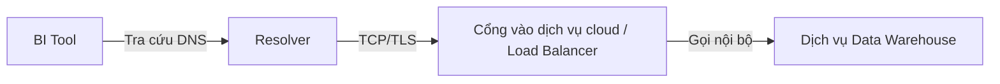

# Phase 0 – Tư duy về Network
## Module 01 – Network là gì?

---

### 1. Mục tiêu của module
Sau khi hoàn thành module này, người học:
- **Nắm được** một định nghĩa rõ ràng, súc tích về “network”.
- **Mô tả được** đường đi cơ bản của dữ liệu từ một máy tính cá nhân đến kho dữ liệu trên cloud (Snowflake, BigQuery, Redshift…).
- **Phân biệt được** các khái niệm chính: thiết bị (host), đường truyền (link), giao thức (protocol), mạng cục bộ (LAN), mạng diện rộng (WAN), Internet.
- **Nhận diện được** mối liên hệ giữa các lỗi phổ biến như `Query timeout`, `Connection refused`, `DNS error` với các thành phần khác nhau trên đường đi của dữ liệu.
- **Hình thành** bộ câu hỏi khởi đầu để phân tích và debug các vấn đề liên quan đến network trong hệ thống dữ liệu.

---

### 2. Vai trò của network trong công việc Analytics / Data
Trong hệ thống dữ liệu hiện đại, hầu hết các thành phần đều giao tiếp với nhau qua network:

- **Snowflake / BigQuery / Redshift**
  - Công cụ BI, dbt, Airflow, notebook… kết nối đến endpoint của kho dữ liệu thông qua Internet hoặc mạng riêng trên cloud (VPC).
  - Các hiện tượng như *truy vấn chậm, timeout* có thể xuất phát không chỉ từ tối ưu hóa truy vấn mà còn từ DNS, định tuyến, tường lửa, cân bằng tải.

- **Databricks / Spark**
  - Tiến trình điều phối (driver) và các tiến trình thực thi (executor) trao đổi dữ liệu qua mạng nội bộ của cluster.
  - Độ trễ cao hoặc mất gói trong mạng dẫn tới shuffle chậm, job kéo dài, vi phạm SLA.

- **Kafka**
  - Producer, broker, consumer sử dụng kết nối TCP. Sai hostname, sai port hoặc cấu hình bảo mật không đúng dẫn tới không thể gửi/nhận dữ liệu hoặc độ trễ (lag) tăng cao.

- **Airflow**
  - Nhiều task thực hiện việc gọi API hoặc kết nối tới cơ sở dữ liệu. Tất cả đều phụ thuộc vào các yếu tố mạng như DNS, routing, firewall, NAT, proxy.

- **PostgreSQL / MySQL**
  - Hoạt động như các dịch vụ TCP chạy trên những cổng xác định. Ứng dụng cần resolve được hostname, đi qua các router/switch/VPC và đến đúng port dịch vụ.

> [!IMPORTANT]
> Trong bối cảnh đó, hiểu biết về network là điều kiện cần để phân biệt rõ nguyên nhân lỗi xuất phát từ ứng dụng hay từ hạ tầng mạng.

---

### 3. Network là gì?

#### 3.1. So sánh với việc gửi thư
Một hệ thống gửi thư truyền thống gồm:
- **Người gửi và người nhận**.
- **Các tuyến đường và điểm trung chuyển**: bưu cục, xe tải, máy bay…
- **Một bộ quy tắc chung**: cách ghi địa chỉ, dán tem, đóng gói bưu gửi.

Trong hệ thống máy tính:
- **Thiết bị (host)**: laptop, máy chủ, máy ảo, container, điện thoại thông minh…
- **Đường truyền (link)**: dây mạng, cáp quang, WiFi, 4G/5G…
- **Giao thức (protocol)**: bộ quy tắc về định dạng, cách gửi và cách xử lý dữ liệu (IP, TCP, HTTP…).

> [!NOTE]
> **Định nghĩa trực quan:**
> Network là tập hợp nhiều thiết bị được kết nối với nhau thông qua các loại đường truyền khác nhau và sử dụng chung các giao thức để trao đổi dữ liệu.

#### 3.2. Sơ đồ minh họa
Ví dụ đường đi của một truy vấn từ máy cá nhân đến một dashboard BI trên cloud:

```mermaid
flowchart TD
    A[Laptop]
    B[Modem/Router tại nhà hoặc văn phòng]
    C[Mạng Internet<br/>(ISP, nhiều router trung gian)]
    D[Cloud Load Balancer]
    E[Mạng riêng trên cloud (VPC)]
    F[Dịch vụ Data Warehouse / API]

    A -->|WiFi / Ethernet| B
    B --> C
    C --> D
    D --> E
    E --> F
```

> [!WARNING]
> Mỗi nút trong sơ đồ là một điểm tiềm năng phát sinh sự cố liên quan đến network.

---

### 4. Các khái niệm cốt lõi

#### 4.1. Thiết bị (Host)
- **Host** là thiết bị có khả năng gửi hoặc nhận dữ liệu trên mạng: máy tính cá nhân, máy chủ, máy ảo, container…
- Mỗi host trong mạng IP có ít nhất một địa chỉ IP, và thường có thêm tên định danh (hostname) để con người dễ sử dụng.

*Ví dụ trong hệ thống dữ liệu:*
Endpoint của Snowflake/BigQuery, Kafka broker, PostgreSQL server, container Airflow worker… đều là các host trong một hoặc nhiều mạng.

#### 4.2. Đường truyền (Link / Medium)
Dữ liệu truyền qua các dạng tín hiệu vật lý:
- Dòng điện trong dây đồng.
- Ánh sáng trong cáp quang.
- Sóng vô tuyến trong WiFi, 4G/5G.

Ở tầng thấp có các khái niệm như Ethernet, WiFi, khung dữ liệu (frame), địa chỉ MAC, switch…

*Liên hệ với hệ thống dữ liệu:*
- Cluster Spark trong cùng một trung tâm dữ liệu thường sử dụng mạng nội bộ tốc độ cao (10G, 40G…) để tối ưu shuffle.
- Kafka brokers đặt gần nhau về mặt hạ tầng (cùng rack, cùng availability zone) sẽ ổn định hơn triển khai phân tán giữa nhiều khu vực địa lý.

#### 4.3. Giao thức (Protocol)
- **Giao thức** là tập các quy tắc chung cho việc trao đổi dữ liệu giữa các thiết bị: cấu trúc gói tin, cách gửi, cách xác nhận, cách xử lý lỗi…
- Một số ví dụ:
  - **Tầng mạng**: IP.
  - **Tầng vận chuyển**: TCP, UDP.
  - **Tầng ứng dụng**: HTTP, giao thức PostgreSQL, giao thức Kafka…

Nếu không dùng chung giao thức, các thiết bị về cơ bản không thể hiểu được dữ liệu của nhau.

*Trong hệ thống dữ liệu:*
Các driver JDBC/ODBC chính là hiện thực của các giao thức, giúp ứng dụng (Spark, Airflow, công cụ BI…) giao tiếp với cơ sở dữ liệu hoặc kho dữ liệu.

#### 4.4. LAN, WAN, Internet

| Khái niệm | Mô tả |
| :--- | :--- |
| **LAN (Local Area Network)** | Mạng cục bộ. Phạm vi địa lý nhỏ: nhà, văn phòng, trường học, một tòa nhà… Thường do một tổ chức hoặc cá nhân trực tiếp quản lý. |
| **WAN (Wide Area Network)** | Mạng diện rộng. Kết nối nhiều LAN nằm ở các vị trí địa lý khác nhau (ví dụ các chi nhánh ở nhiều thành phố). Thường dựa vào hạ tầng mạng của nhà cung cấp dịch vụ viễn thông. |
| **Internet** | Là mạng lưới rất lớn được tạo thành từ nhiều LAN và WAN kết nối với nhau thông qua hệ thống router. Sử dụng chung họ giao thức TCP/IP. |

*Trong môi trường cloud:*
> [!TIP]
> **VPC (Virtual Private Cloud)** là một mạng riêng ảo của khách hàng, nằm bên trong hạ tầng của nhà cung cấp cloud. Có thể xem VPC như một LAN nội bộ triển khai trên hạ tầng của AWS, GCP hoặc Azure.

#### 4.5. Mô hình OSI và mô hình TCP/IP
Ở mức khái niệm:
- **Mô hình OSI (7 tầng)**: là mô hình lý thuyết dùng để phân tách chức năng của mạng thành các tầng độc lập, thuận tiện cho việc thiết kế và tư duy.
- **Mô hình TCP/IP**: là tập hợp các giao thức thực tế đang vận hành Internet, thường được gom thành 4–5 tầng.

Hình dung đơn giản:

```mermaid
flowchart TD
    A[Tầng ứng dụng<br/>(BI tool, Spark, Kafka, DB...)]
    B[Giao thức ứng dụng<br/>(HTTP, giao thức DB...)]
    C[Tầng vận chuyển<br/>(TCP / UDP)]
    D[Tầng mạng<br/>(IP)]
    E[Tầng liên kết<br/>(Ethernet / WiFi ...)]

    A --> B --> C --> D --> E
```

Khi phân tích lỗi, việc xác định lỗi nằm ở tầng nào trong chuỗi này là bước quan trọng.

#### 4.6. Dòng chảy dữ liệu trong hệ thống dữ liệu
Ví dụ pipeline streaming:

```mermaid
flowchart LR
    A[API nguồn] -->|HTTP| B[Kafka Broker]
    B -->|TCP| C[Spark Streaming Job]
    C -->|JDBC / HTTP| D[Data Warehouse<br/>(Snowflake/BigQuery)]
```

- Mỗi mũi tên biểu diễn một đoạn kết nối mạng (network hop).
- Mỗi đoạn có thể gặp lỗi riêng: DNS, tường lửa, TLS, timeout, sai định tuyến…

---

### 5. Network trong môi trường production

#### 5.1. Đường đi của một BI query
Ví dụ: công cụ BI trên máy tính cá nhân truy vấn BigQuery:

```mermaid
flowchart TD
    A[Công cụ BI trên laptop]
    B[Router tại nhà hoặc văn phòng]
    C[Cân bằng tải<br/>của nhà cung cấp cloud]
    D[Dịch vụ BigQuery]

    A -->|1. Tra cứu DNS<br/>"bigquery.googleapis.com" → IP| B
    B -->|2. Truyền qua hạ tầng ISP<br/>và nhiều router trên Internet| C
    C -->|3. Mạng nội bộ trên cloud<br/>(VPC, service mesh... )| D
```

**Các điểm dễ phát sinh vấn đề:**
- DNS phản hồi chậm, sai hoặc không phản hồi.
- Đường truyền quốc tế bất ổn, độ trễ cao, mất gói.
- Tường lửa hoặc proxy của doanh nghiệp chặn một số domain, port hoặc can thiệp vào TLS.

#### 5.2. Pipeline đi qua nhiều lớp mạng
Ví dụ pipeline: API → Kafka → Spark → Postgres, điều phối bởi Airflow:

```mermaid
flowchart LR
    A[API nguồn] -->|Internet| B[Kafka Cluster (VPC A)]
    B -->|Kết nối giữa VPC<br/>(VPC peering / Private Link)| C[Spark Cluster (VPC B)]
    C -->|JDBC| D[Máy chủ Postgres]
    D --> E[Airflow Scheduler]
```

Khi các task của Airflow thất bại hoặc job Spark bị timeout, cần xem xét không chỉ mã nguồn mà cả sơ đồ mạng ở phía sau.

---

### 6. Các lỗi network thường gặp trong hệ thống dữ liệu

1. **Lỗi DNS**
   - *Ví dụ:* `psql -h mydb.internal` báo “could not translate host name”.
   - Công cụ BI không kết nối được warehouse vì hostname chỉ có thể resolve từ bên trong VPC, không từ môi trường bên ngoài.
2. **Lỗi định tuyến, tường lửa, security group**
   - Airflow trong VPC không gọi được Cloud SQL/Postgres do thiếu rule hoặc security group.
   - Kafka consumer ở VPC khác không đến được broker vì chưa thiết lập route hoặc peering.
3. **Lỗi kết nối TCP**
   - Thông báo “Connection refused”, “Connection timed out” trên các port 5432, 9092, 443…
   - *Nguyên nhân:* dịch vụ không chạy, cấu hình port sai, tường lửa chặn hoặc không có đường đi.
4. **Lỗi TLS / HTTPS**
   - Khi gọi API qua HTTPS xuất hiện “SSL handshake failed”, “certificate verify failed”.
   - *Nguyên nhân:* thường liên quan tới chứng chỉ, hostname, proxy can thiệp vào kết nối TLS.
5. **Mạng tắc nghẽn hoặc chập chờn**
   - Độ trễ tăng, lưu lượng bị mất, truy vấn và ETL bị timeout, Kafka lag tăng, Spark shuffle treo.
   - *Nguyên nhân:* Thường do tắc nghẽn (congestion) hoặc mất gói (packet loss) trên các đoạn đường truyền quan trọng.

---

### 7. Sổ tay debug cơ bản

**Chuỗi kiểm tra cơ bản khi gặp lỗi kết nối:**
1. **Kiểm tra hostname**: có chính xác, đầy đủ, không sai chính tả hay thiếu phần domain.
2. **Kiểm tra DNS**: hostname có được dịch sang IP hợp lệ (sử dụng `dig`, `nslookup`).
3. **Kiểm tra đường đi**: từ môi trường chạy ứng dụng (laptop, Airflow worker, Spark driver…), có thể `ping` hoặc `traceroute` đến IP đó hay không.
4. **Kiểm tra port**: dịch vụ có đang lắng nghe trên port mong muốn, firewall/security group có cho phép kết nối hay không.
5. **Nếu sử dụng HTTPS**: chứng chỉ có hợp lệ, hostname có trùng với thông tin trong chứng chỉ.
6. **Kiểm tra kiến trúc**: hệ thống đang chạy on-prem, trên cloud hay hybrid; có VPC, VPN, NAT, proxy nào nằm giữa các thành phần hay không.

**Một số lệnh thường dùng:**
```bash
ping <hostname>              # kiểm tra phản hồi và độ trễ
traceroute <hostname>        # (Windows: 'tracert') kiểm tra các hop trung gian
mtr <hostname>               # kết hợp traceroute + ping theo thời gian

dig <hostname>               # tra cứu thông tin DNS
curl -v https://endpoint     # kiểm tra HTTP/HTTPS, header, quá trình bắt tay TLS

telnet <host> <port>         # thử mở kết nối TCP tới một cổng (nếu được phép)
nc -vz <host> <port>         # kiểm tra nhanh port bằng netcat
```

---

### 8. Ví dụ gắn với hệ thống dữ liệu

#### 8.1. Truy vấn Snowflake/BigQuery bị timeout
**Bối cảnh:**
Một truy vấn gửi từ công cụ BI chạy lâu hơn bình thường và kết thúc bằng lỗi timeout.

**Các khả năng:**
- Bản thân truy vấn nặng, kế hoạch thực thi không tối ưu.
- Đường mạng từ nơi chạy BI đến kho dữ liệu gặp vấn đề về DNS, độ trễ, mất gói hoặc proxy.

**Hướng phân tích:**

> Cách kiểm tra: chạy lại truy vấn từ môi trường khác (ví dụ VM trong cùng region), kết hợp đo kiểm kết nối bằng `ping`, `curl`.

#### 8.2. Kafka lag tăng
- Producer/consumer và Kafka brokers nằm ở các vùng hoặc VPC khác nhau.
- Độ trễ mạng cao hoặc mất gói khiến producer phải retry, consumer nhận chậm, dẫn đến lag tăng.
- Biểu hiện trên dashboard monitoring chỉ là “lag tăng”, nhưng nguyên nhân gốc lại nằm ở network.

#### 8.3. Airflow không kết nối được Postgres
- Airflow chạy dưới dạng dịch vụ quản lý (ví dụ Composer), còn Postgres ở Cloud SQL hoặc một VM riêng.
- Kết nối sử dụng private IP, nhưng chưa cấu hình đúng firewall hoặc route.
- Hậu quả: DNS vẫn resolve được hostname, nhưng gói tin không đến được đích hoặc bị chặn port.

---

### 9. Tóm tắt

- **Network** là tập hợp các thiết bị được kết nối với nhau qua những đường truyền vật lý hoặc không dây và sử dụng các giao thức chung để trao đổi dữ liệu.
- **Internet** là mạng lưới được ghép lại từ nhiều mạng con (LAN, WAN) thông qua hệ thống router, vận hành trên nền tảng TCP/IP; trên cloud, VPC có thể coi như một mạng LAN riêng ảo.
- Các thành phần trong hệ sinh thái dữ liệu hiện đại (Snowflake, BigQuery, Spark, Kafka, Airflow, PostgreSQL/MySQL…) đều phụ thuộc mạnh mẽ vào hạ tầng mạng phía dưới.
- Những lỗi như `timeout`, `connection failed`, `lag` thường liên quan chặt chẽ đến network. Để phân tích nguyên nhân gốc cho hệ thống dữ liệu, cần nắm rõ đường đi của gói tin và các điểm có thể phát sinh sự cố trên đường đi đó.