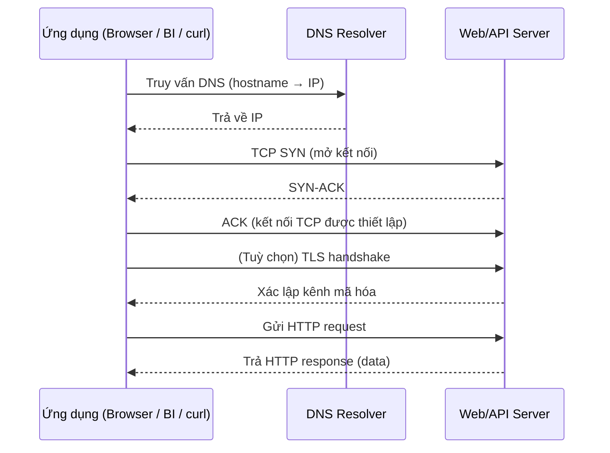
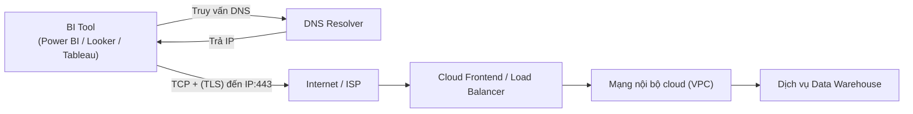
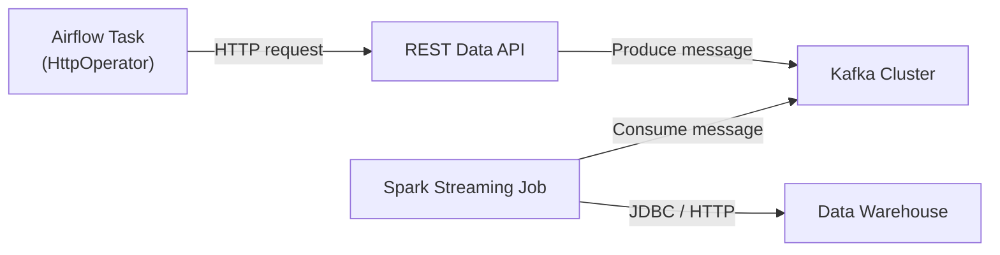
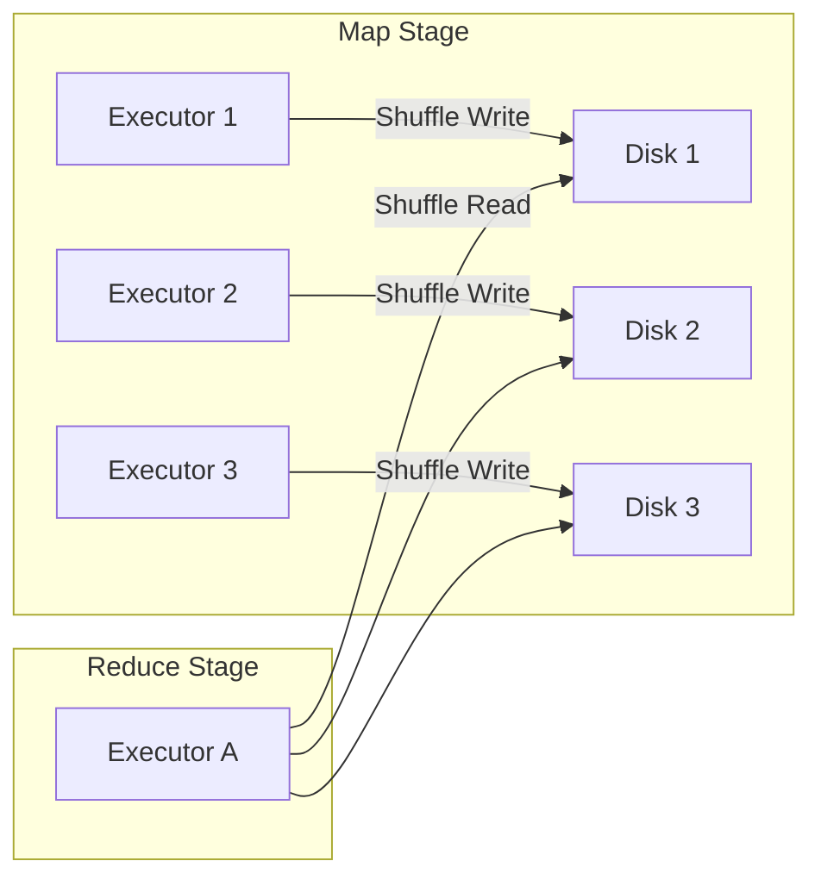
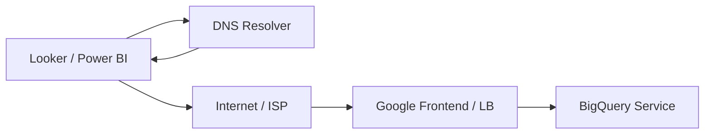
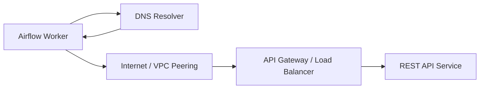

# Phase 0 – Tư duy về Network
## Module 02 – Dữ liệu đi từ A đến B như thế nào?

---

### 1. Mục tiêu của module

Sau khi hoàn thành module này, người học:

- **Hiểu được** bức tranh tổng thể: khi một ứng dụng gửi request, dữ liệu đi qua những bước nào trước khi tới đích và quay trở lại.  
- **Mô tả được** luồng dữ liệu end-to-end ở mức “request flow” (từ ứng dụng → DNS → TCP → HTTP → service).  
- **Nhận diện được** các điểm có thể hỏng trên đường đi (DNS, kết nối TCP, TLS, HTTP, routing, load balancer…).  
- **Áp dụng được** tư duy “vẽ flow trước khi debug” cho các hệ thống dữ liệu: BI ↔ Data Warehouse, Airflow ↔ API/DB, Kafka ↔ Producer/Consumer, Spark shuffle.  
- **Kết nối được** luồng dữ liệu với các tầng trong mô hình TCP/IP / OSI ở mức khái niệm (sẽ đào sâu hơn ở các phase sau).

---

### 2. Bức tranh tổng thể: từ request đến response

Khi một ứng dụng (trình duyệt, BI tool, Airflow task, Spark driver…) “gửi dữ liệu” tới một dịch vụ ở xa, thường sẽ trải qua chuỗi bước logic sau:

1. Ứng dụng chuẩn bị **request** (HTTP request, truy vấn SQL, message Kafka…).  
2. Máy gửi cần biết **IP đích** → thực hiện **DNS lookup** nếu chỉ có hostname.  
3. Thiết lập **kết nối TCP** tới IP và port tương ứng (ví dụ 443 cho HTTPS, 5432 cho Postgres).  
4. (Nếu dùng HTTPS) Thiết lập **phiên TLS** trên kết nối TCP.  
5. Gửi **dữ liệu ứng dụng** (HTTP request, gói tin DB, record Kafka…) qua kết nối TCP/TLS.  
6. Dữ liệu đi qua nhiều **router, switch, load balancer** trước khi tới đúng service.  
7. Service xử lý, gửi **response** theo đường ngược lại (vẫn qua các tầng TCP/IP tương tự).  

> [!IMPORTANT]
> Từ góc độ Networking cho Data, điều quan trọng không phải là thuộc lòng tên từng bước, mà là luôn có thói quen **vẽ lại luồng dữ liệu** trước khi debug: “ai gọi ai, qua những lớp nào, dùng giao thức gì, port nào”.

---

### 3. Luồng dữ liệu: từ máy cá nhân đến dịch vụ web/API

#### 3.1. Bước 1: Ứng dụng tạo request

Ví dụ:

- Trình duyệt mở `https://app.snowflake.com/...`  
- BI tool gửi query tới BigQuery REST API.  
- `curl https://data-api.example.com/endpoint`  
- Airflow HttpOperator gọi một REST API.

Ở thời điểm này, ứng dụng mới chỉ tạo **request ở tầng ứng dụng** (HTTP, SQL, JSON payload…), chưa gửi đi đâu cả.

#### 3.2. Bước 2: DNS lookup – tìm IP từ hostname

- Nếu chỉ có hostname (`app.snowflake.com`, `bigquery.googleapis.com`), hệ thống cần tìm **địa chỉ IP** tương ứng.  
- Trình duyệt / ứng dụng sẽ:
  - Kiểm tra cache DNS cục bộ (trình duyệt, hệ điều hành).  
  - Nếu không có, gửi truy vấn đến **DNS resolver** (thường là DNS của ISP hoặc DNS public như 8.8.8.8).  
- Resolver có thể phải hỏi tiếp root server, TLD server, authoritative server trước khi trả về IP.

> [!NOTE]
> DNS chỉ trả lời câu hỏi: “Hostname này có IP là gì?”. HTTP request không đi qua DNS server, chỉ có truy vấn DNS đi qua đó.

#### 3.3. Bước 3: Thiết lập kết nối TCP

Khi đã biết IP và port:

- Hệ điều hành trên máy gửi sẽ yêu cầu **thiết lập kết nối TCP** tới IP/port đó (ví dụ: IP của BigQuery, port 443).  
- TCP sử dụng **bắt tay 3 bước (three-way handshake)**:
  - Client gửi **SYN**.  
  - Server trả lời **SYN-ACK** nếu chấp nhận.  
  - Client gửi **ACK** để xác nhận.  

Sau khi bắt tay xong:

- Hai bên đã có một **kết nối TCP** hai chiều, đáng tin cậy (reliable), có thứ tự (ordered).  
- Tất cả dữ liệu tiếp theo sẽ được gửi thành các **segment TCP**, được IP đóng gói thành các **packet** và được tầng liên kết chuyển thành **frame** để đi trên dây / WiFi.

#### 3.4. Bước 4: (Tùy chọn) Bắt tay TLS

Nếu dùng HTTPS:

- Trên kết nối TCP vừa thiết lập, client và server thực hiện **TLS handshake**:
  - Thống nhất bộ mã hóa.  
  - Xác thực chứng chỉ server.  
  - Thiết lập khóa phiên để mã hóa dữ liệu.  

Sau bước này, dữ liệu ứng dụng sẽ được mã hóa trước khi “nhét” vào segment TCP.

> [!WARNING]
> Lỗi TLS (sai chứng chỉ, hostname không khớp, CA không tin cậy) có thể khiến **HTTP chưa kịp gửi** đã fail, dù DNS và TCP đều ổn.

#### 3.5. Bước 5: Gửi HTTP request / nhận HTTP response

- Khi đã có kết nối (TCP hoặc TCP+TLS), ứng dụng gửi **HTTP request**:
  - Request line (method, path, version).  
  - Header (Host, Authorization, Content-Type…).  
  - Body (nếu có, ví dụ POST/PUT với JSON).  
- Server xử lý và trả về **HTTP response**:
  - Status line (HTTP/1.1 200 OK).  
  - Header.  
  - Body (JSON, HTML, file…).  

Toàn bộ request/response được chia nhỏ thành các packet/segment TCP, đi qua Internet theo đúng các tầng TCP/IP, nhưng từ góc độ ứng dụng, chỉ thấy “gửi HTTP request và nhận response”.

---

#### 3.6. Sơ đồ tổng quan – từ URL đến HTTP response

> [!IMPORTANT]
> Từ góc nhìn debug: mọi lỗi từ “không resolve được hostname” cho đến “timeout khi gọi API” đều có thể được map vào một bước cụ thể trong sequence diagram này.

---

### 4. Luồng dữ liệu trong hệ thống dữ liệu

#### 4.1. BI tool → Data Warehouse (Snowflake / BigQuery / Redshift)

Luồng điển hình:

Các bước chính:

- BI tool thực hiện DNS lookup cho hostname của warehouse.  
- Thiết lập kết nối TCP/TLS tới cổng của dịch vụ (thường là 443 – HTTPS).  
- Gửi **query** thông qua API / giao thức riêng của nhà cung cấp (thường chạy trên HTTP/HTTPS).  
- Nhận **kết quả truy vấn** dưới dạng JSON, Arrow, hoặc một format khác.  

> [!WARNING]
> Query timeout không phải lúc nào cũng là “do query chậm”: có thể request đi được nhưng response bị mất, TTL DNS quá thấp gây flapping, hoặc đường mạng tới region cloud có vấn đề.

#### 4.2. Airflow task → REST API → Kafka → Spark → Warehouse

Ví dụ một pipeline dữ liệu event / log:

- Airflow gửi HTTP request tới REST API (đã qua DNS, TCP, TLS, HTTP như phần trên).  
- API chuyển dữ liệu vào Kafka (sử dụng TCP, giao thức Kafka).  
- Spark Streaming job đọc từ Kafka qua kết nối TCP, xử lý, ghi ra warehouse (qua JDBC hoặc HTTP API).  

Mỗi mũi tên trong sơ đồ là một **luồng dữ liệu riêng** với các bước DNS → TCP → (TLS) → giao thức ứng dụng tương ứng.

#### 4.3. Spark shuffle – dữ liệu di chuyển giữa các executor

Trong Spark, khi có **shuffle** (group by, repartition, join…), dữ liệu phải di chuyển qua lại giữa các executor:

- Mỗi executor ghi **shuffle file** ra local disk (một file cho mỗi partition reduce).  
- Executor reduce sau đó **kéo dữ liệu qua mạng** từ tất cả các executor map (all-to-all).  
- Toàn bộ quá trình này sử dụng **TCP** giữa các node, chịu giới hạn bởi băng thông mạng và I/O đĩa.  

> [!NOTE]
> Shuffle chính là ví dụ điển hình cho việc “dữ liệu đi từ A đến B (và đến rất nhiều B khác)” bên trong một cluster, hoàn toàn dựa trên networking.

---

### 5. Tư duy “request flow” khi debug

Khi phân tích một vấn đề trong hệ thống dữ liệu, một trong những bước quan trọng nhất là **viết ra luồng request/response**:

1. Ai là **client**? (BI tool, Airflow, Spark driver, producer…)  
2. Ai là **server**? (API, broker Kafka, DB, warehouse…)  
3. Các thành phần trung gian:
   - DNS resolver.  
   - Router, firewall, load balancer, reverse proxy.  
   - Service mesh / API gateway (nếu có).  
4. Request dùng:
   - Giao thức gì? (HTTP, gRPC, JDBC, Kafka protocol…).  
   - Port nào? (443, 9092, 5432…).  
5. Mỗi đoạn (hop) có:
   - Bước DNS riêng không?  
   - Thiết lập TCP riêng không?  
   - Bắt tay TLS riêng không?

> [!TIP]
> Một câu hỏi đơn giản nhưng rất hữu ích:  
> “**Gói tin đầu tiên** từ client đi đến đâu, theo thứ tự các hop nào, trước khi chạm được vào service cần debug?”

---

### 6. Gắn luồng dữ liệu với các tầng TCP/IP / OSI

Ở mức khái quát, bất kỳ request nào (BI → BigQuery, Airflow → API, Spark → Kafka) cũng đi qua các tầng sau:

| Tầng | Ví dụ trong luồng dữ liệu |
| :--- | :------------------------ |
| **Ứng dụng** | BI tool, trình duyệt, Airflow, Spark, Kafka client, DB client… |
| **Giao thức ứng dụng** | HTTP, HTTPS, gRPC, giao thức PostgreSQL, giao thức Kafka… |
| **Tầng vận chuyển** | TCP (đa số trường hợp), đôi khi UDP (DNS, một số telemetry) |
| **Tầng mạng** | IP (IPv4/IPv6) – định tuyến gói tin giữa các mạng, qua router |
| **Tầng liên kết / vật lý** | Ethernet, WiFi, 4G/5G, cáp quang, frame, MAC, switch… |

Module này tập trung vào **dòng chảy từ trên xuống** (ứng dụng → network), các phase sau sẽ phóng to từng đoạn: DNS (Phase 2), TCP (Phase 3), HTTP/TLS (Phase 4), Cloud Networking (Phase 6), Data Platform Networking (Phase 7).

---

### 7. Các điểm hỏng phổ biến trên flow

Theo chuỗi bước đã mô tả:

1. **DNS không trả IP đúng**
   - Hostname gõ sai.  
   - Bản ghi DNS cấu hình sai hoặc chưa propagate.  
   - Resolver bị lỗi hoặc bị chặn.  

2. **Không thiết lập được kết nối TCP**
   - Port không mở hoặc service không lắng nghe.  
   - Firewall / security group / network ACL chặn.  
   - Route không tồn tại hoặc sai (không có đường tới subnet/VPC đó).  

3. **TLS handshake thất bại**
   - Chứng chỉ hết hạn, không được tin cậy.  
   - Hostname không khớp với certificate.  
   - Proxy công ty chặn hoặc thay cert (TLS inspection).  

4. **HTTP lỗi / timeout**
   - Request bị chặn bởi reverse proxy / WAF.  
   - Service trả về 4xx/5xx (app error).  
   - Request/response quá lớn, vượt quá timeout hoặc limit cấu hình.  

5. **Lỗi ở network nội bộ dịch vụ**
   - Service phía sau load balancer không reach được DB/Kafka/Service khác.  
   - VPC peering, private link, route nội bộ bị cấu hình sai.  
   - Bottleneck tại tầng shuffle (Spark), replication (Kafka) do network.  

> [!WARNING]
> Không nên vội vàng kết luận “do tool A / tool B” trước khi rõ **request flow** và xác định được request đang fail ở bước nào.

---

### 8. Ví dụ gắn với hệ thống dữ liệu

#### 8.1. Looker / Power BI → BigQuery bị timeout

Luồng:

Khả năng lỗi:

- DNS: hostname BigQuery không resolve được hoặc trả IP sai.  
- TCP/TLS: không thiết lập được kết nối 443 (bị chặn, handshake lỗi).  
- HTTP: request tới nhưng bị reject/throttling từ phía frontend.  
- Nội bộ: BigQuery xử lý chậm, nhưng từ góc nhìn network vẫn thấy là response đến muộn.

#### 8.2. Airflow HttpOperator gọi REST API

Luồng:

Để debug:

- Thử `dig`/`nslookup` từ chính Airflow worker.  
- Thử `curl -v` tới endpoint từ worker.  
- Kiểm tra security group / firewall trên subnet chứa worker và service.  
- Nếu qua API Gateway, kiểm tra log của gateway để xem request có tới hay không.

#### 8.3. Spark job với shuffle nặng

- Mỗi executor map ghi shuffle file ra local disk, mỗi executor reduce kéo dữ liệu từ tất cả executor map qua TCP.  
- Nếu network trong cluster yếu hoặc đang bị nghẽn, shuffle read sẽ kéo dài, gây ra “Spark job chạy mãi không xong”.  

Tư duy:

- Vẽ lại sơ đồ: executor nào nói chuyện với executor nào, qua network nào (1 AZ, 2 AZ, cross-region?).  
- Kiểm tra metric về network I/O, disk I/O, số lượng shuffle partitions, số lượng file.  

---

### 9. Tóm tắt

- Mỗi lần “gửi dữ liệu từ A đến B” trong hệ thống dữ liệu đều đi qua chuỗi: **ứng dụng → DNS → TCP (+ TLS) → giao thức ứng dụng (HTTP/SQL/Kafka…) → service**, rồi quay lại theo đường ngược lại.  
- Nhìn được **request flow** end-to-end là điều kiện tiên quyết để debug các lỗi network liên quan đến BI, Airflow, Kafka, Spark, Data Warehouse…  
- Mỗi bước trong flow (DNS, TCP, TLS, HTTP, routing, load balancer, internal service call) đều có thể là điểm hỏng, và đều có công cụ đo/quan sát riêng (dig, ping, traceroute, curl, log, metric…).  
- Module này đóng vai trò “bản đồ đường đi”, các phase tiếp theo sẽ phóng to từng đoạn: DNS (Phase 2), TCP (Phase 3), HTTP/TLS (Phase 4), Cloud Networking (Phase 6), Data Platform Networking (Phase 7).