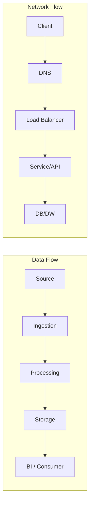

# Phase 0 – Tư duy về Network
## Module 03 – Networking dành cho Analytics / Data Engineers


---


### 1. Mục tiêu của module

Sau khi hoàn thành module này, người học:

- **Xác định được** vì sao Networking là kỹ năng cốt lõi với Analytics / Data / BI / Analytics Engineer, không chỉ riêng Network Engineer.  
- **Nhìn được** hệ thống dữ liệu đang làm (DW, Kafka, Spark, Airflow, DB…) như một tập các dòng lưu lượng (traffic) và kết nối (connections), không chỉ là “các tool rời rạc”.  
- **Nhận diện được** các tình huống công việc hằng ngày có yếu tố network: query chậm, DAG fail, Kafka lag, job Spark treo, lỗi kết nối DB, lỗi TLS/DNS…  
- **Định hình được** bộ năng lực Networking tối thiểu cho từng mức độ (junior, mid, senior) trong vai trò Analytics/Data.  
- **Có trong tay** một số checklist / câu hỏi khởi đầu để đưa Networking vào tư duy thiết kế và debug.


---


### 2. Analytics / Data Engineer nhìn dưới góc độ network

Trong thực tế, phần lớn công việc của Analytics / Data Engineer đều liên quan trực tiếp hoặc gián tiếp tới network:

- Chuẩn bị dữ liệu từ nhiều nguồn: API, database, file trên cloud storage → tất cả đều là kết nối network.  
- Xây dựng pipeline qua nhiều bước: Airflow → Kafka → Spark → Warehouse → BI → mỗi mũi tên là một đường network.  
- Làm việc trên cloud / hybrid: on-prem ↔ cloud, giữa nhiều VPC, nhiều account, nhiều region.

> [!IMPORTANT]
> Từ góc nhìn Networking, một hệ thống dữ liệu không chỉ là “data flow” mà là **“data flow chạy trên network flow”**. Data không thể đi nếu network không cho phép.


#### 2.1. Hình ảnh tổng thể

```mermaid
flowchart LR
    subgraph Client
        BI[BI Tools<br/>(Tableau/Looker/Power BI)]
        NB[Notebook / DBT / Scripts]
    end

    subgraph Orchestration
        AF[Airflow / Orchestrator]
    end

    subgraph DataPlatform
        DW[Data Warehouse<br/>(Snowflake/BigQuery/Redshift)]
        DB[(PostgreSQL / MySQL)]
        K[Kafka Cluster]
        SP[Spark / Databricks]
    end

    Client -->|Queries / API| DW
    Client -->|JDBC/ODBC| DB
    AF -->|HTTP / JDBC| DW
    AF -->|HTTP| K
    AF -->|JDBC| DB
    K --> SP
    SP --> DW
    SP --> DB
```

Mỗi mũi tên trong sơ đồ trên đều ẩn bên dưới: DNS, TCP, TLS, routing, firewall, VPC, load balancer, security group, NAT…


---


### 3. Những vấn đề network thường gặp “tưởng như không phải network”

Dưới đây là các tình huống điển hình mà người làm Analytics / Data hay gặp, nhưng ban đầu thường chỉ nghĩ đến SQL, code, hoặc “tool lỗi”.

#### 3.1. Query trên warehouse: chậm, timeout, thất thường

- Trên giao diện BI hoặc console warehouse thấy:
  - Query thỉnh thoảng rất chậm dù plan không đổi.  
  - Một số người dùng ở vị trí địa lý khác chậm hơn nhiều.  
- Khả năng liên quan network:
  - Đường truyền quốc tế / liên vùng có vấn đề.  
  - DNS của một số ISP resolve tới IP/front-end khác.  
  - Proxy / firewall nội bộ can thiệp vào TLS.

#### 3.2. Airflow DAG: task gọi API / DB fail ngẫu nhiên

- Một số task HttpOperator / JDBCOperator fail với lỗi connection timeout / TLS error.  
- Code không đổi, API vẫn hoạt động với client khác.  
- Khả năng network:
  - Security group / firewall cập nhật gần đây chặn outbound.  
  - Route từ subnet chứa worker tới service bị thay đổi.  
  - DNS hoặc proxy trong environment của Airflow khác với laptop.

#### 3.3. Kafka lag tăng mà không rõ lý do

- Producer/consumer report throughput giảm, lag tăng dần.  
- Cluster Kafka hoặc code gần như không đổi.  
- Khả năng network:
  - Băng thông giữa VPC/region giảm, tăng latency.  
  - Packet loss khiến TCP phải retransmit nhiều.  
  - Load balancer hoặc proxy trung gian thêm hop.

#### 3.4. Spark job với shuffle nặng: thời gian chạy biến động mạnh

- Cùng một job, cùng lượng dữ liệu, nhưng đôi khi chạy gấp đôi thời gian.  
- Stage shuffle có thời gian lâu bất thường.  
- Khả năng network:
  - Congestion trên mạng nội bộ cluster.  
  - Một số node bị lỗi NIC / cáp / switch.  
  - Resource network bị tranh chấp với workload khác.

> [!NOTE]
> Điểm chung: nếu không có thói quen nghĩ đến network, các sự cố trên dễ bị gán hoàn toàn cho “tool chậm” hoặc “cloud có vấn đề”.


---


### 4. Năng lực networking theo cấp độ Analytics / Data

Bảng dưới gợi ý “minimum” về networking cho từng mức độ trong vai trò Analytics / Data Engineer (không phải chuẩn bắt buộc, mà là mục tiêu cá nhân).

| Cấp độ | Năng lực Networking kỳ vọng |
| :----- | :------------------------- |
| **Junior** | Hiểu sơ bộ DNS, IP, port; biết dùng `ping`, `traceroute`, `dig`, `curl` để kiểm tra kết nối; hiểu khái niệm VPC ở mức cao. |
| **Mid** | Nắm được TCP handshake, TLS ở mức cơ bản; đọc được lỗi DNS/TLS; hiểu đường đi của request qua load balancer / API gateway; map được request flow của pipeline mình phụ trách. |
| **Senior / Lead** | Thiết kế được data flow gắn với network topology (VPC, subnet, peering, NAT, firewall); chủ động tham gia RCA incident liên quan đến network; làm việc trôi chảy với team SRE/Network/Infra. |
| **Architect / Principal** | Đưa networking trở thành một phần trong kiến trúc data platform (trust boundary, blast radius, multi-region, DR); cân bằng latency, throughput, cost và security trong thiết kế toàn hệ thống. |

> [!TIP]
> Mục tiêu của toàn bộ repo này là đẩy người đọc ít nhất lên mức **Mid** về Networking, ngay cả khi job title không phải là “Network Engineer”.


---


### 5. Các “mental model” quan trọng cho người làm dữ liệu

#### 5.1. Request flow vs. Data flow



- **Data flow** trả lời: dữ liệu đi qua những bước xử lý nào, schema thay đổi ra sao.  
- **Network flow** trả lời: gói tin đi qua những hop nào, dùng giao thức gì, ai có quyền truy cập.  

Một sự cố thường nằm ở **giao điểm**: data flow dựa trên network flow, nên khi network có vấn đề, data flow bị ảnh hưởng.


#### 5.2. Trust boundary & blast radius

```mermaid
flowchart TD
    A[Internet công cộng]
    B[DMZ / Public Subnet]
    C[Private Subnet<br/>(App, Kafka, Spark...)]
    D[Data Subnet<br/>(DW, DB, Storage)]

    A --> B --> C --> D
```

- **Trust boundary**: ranh giới niềm tin – từ Internet vào DMZ, từ DMZ vào subnet private, từ private vào zone dữ liệu nhạy cảm.  
- **Blast radius**: nếu một thành phần bị lỗi / bị tấn công, phạm vi ảnh hưởng lan tới đâu.

Người làm dữ liệu cần hiểu ít nhất:

- Dịch vụ mình dùng đang ở “vùng” nào.  
- Từ đâu có thể kết nối vào nó, qua lớp bảo vệ nào (LB, firewall, auth…).


---


### 6. Map networking vào từng mảng công cụ dữ liệu

#### 6.1. Data Warehouse / Lakehouse

- Tiếp xúc chủ yếu qua:
  - HTTP/HTTPS (REST API, web UI).  
  - JDBC/ODBC (qua TLS trên TCP).  
- Vấn đề network hay gặp:
  - Endpoint public vs. private; region; VPC peering / Private Link.  
  - IP allowlist / firewall rules; proxy nội bộ.  
- Năng lực cần có:
  - Vẽ được sơ đồ kết nối từ BI / ETL tới warehouse.  
  - Hiểu nơi cần mở port / rule, nơi không được mở.

#### 6.2. Databases (PostgreSQL / MySQL / Cloud SQL / RDS)

- Là các dịch vụ TCP (thường là 5432, 3306…).  
- Thường nằm trong subnet private, chỉ cho phép kết nối từ một số mạng / security group.  
- Năng lực cần có:
  - Đọc, hiểu lỗi connection (refused, timeout, host not found).  
  - Biết dùng `psql` / `mysql` + `telnet` / `nc` / `curl` để test kết nối từ đúng môi trường (không chỉ từ laptop).

#### 6.3. Kafka

- Broker và client dùng TCP, với hostname/port cụ thể.  
- Trong cloud, thường chạy trong VPC riêng, có thêm layer security (SASL, SSL, IP restriction).  
- Năng lực cần có:
  - Hiểu route từ producer/consumer đến broker.  
  - Nhận ra khi lag không chỉ là do consumer chậm mà còn do network.

#### 6.4. Spark / Databricks

- Driver nói chuyện với executors, executors nói chuyện với nhau qua network.  
- Shuffle là giai đoạn rất nhạy với băng thông, latency và packet loss.  
- Năng lực cần có:
  - Nhìn dashboard Spark và nhận ra “nút cổ chai network” (shuffle read/write).  
  - Hiểu cluster nằm trong network nào, cross-AZ / cross-region hay không.

#### 6.5. Airflow / Orchestrator

- Mỗi task là một client nhỏ: có thể gọi HTTP, JDBC, gRPC, SSH…  
- Airflow thường chạy trong VPC, cần quyền outbound đến API, DB, DW.  
- Năng lực cần có:
  - Vẽ flow “từ task đến service” cho mỗi loại kết nối chính.  
  - Biết test từ bên trong container/pod worker, không chỉ từ môi trường dev cá nhân.

#### 6.6. Cloud networking (ở mức Phase 0)

- Khái niệm cần hình dung:
  - VPC, subnet, route table.  
  - Security group / firewall / network ACL.  
  - Peering, VPN, NAT, Internet Gateway, Private Link/Service Connect.  
- Mục tiêu module này không giải thích chi tiết, chỉ nhấn mạnh:
  - Từng đường data trong hệ thống đều tương ứng với một đường network cụ thể trên cloud.  
  - Không hiểu sơ đồ VPC/subnet → rất khó debug các vấn đề liên quan tới kết nối.


---


### 7. Checklist tư duy Networking cho Analytics / Data

#### 7.1. Khi thiết kế một pipeline / tích hợp mới

- Service A (client) nằm ở đâu? (on-prem, VPC X, region Y…)  
- Service B (server) nằm ở đâu? (public/private, VPC nào, region nào…)  
- Kết nối dự kiến:
  - Giao thức gì (HTTP, gRPC, JDBC, Kafka…)?  
  - Port nào? qua LB / API Gateway / proxy nào?  
- DNS cần record gì? Ai quản lý?  
- Vùng tin cậy (trust boundary):
  - Traffic đi qua Internet/public hay chỉ trong private network?  
  - Cần thêm lớp auth nào (TLS mutual, token, IAM…)?  

#### 7.2. Khi debug một sự cố

- Request đang fail ở bước nào trong chuỗi: DNS → TCP → TLS → HTTP → app?  
- Có sự khác biệt giữa:
  - Từ máy cá nhân vs từ Airflow worker vs từ Spark driver?  
  - Từ một region/VPC khác nhau?  
- Gần đây có thay đổi nào liên quan đến:
  - DNS record?  
  - Firewall / security group / route table?  
  - Load balancer / API gateway / proxy?


---


### 8. Thói quen cần hình thành

- **Luôn vẽ sơ đồ** khi có sự cố: ít nhất là sequence diagram hoặc flowchart đơn giản.  
- **Luôn test từ đúng nơi**: chạy `curl`, `ping`, `dig` từ Airflow worker, Spark driver, container production – không chỉ từ laptop.  
- **Luôn hỏi “đường mạng”** khi thiết kế: service này ở đâu, traffic đi qua những lớp bảo vệ nào.  
- **Luôn ghi lại pattern**: một khi đã hiểu và fix một loại lỗi network, note lại pattern để lần sau debug nhanh hơn.

---

### 9. Tóm tắt

- Networking đối với Analytics / Data Engineer không phải chuyện cấu hình router, mà là **hiểu cách dữ liệu và request di chuyển trong và ngoài hệ thống dữ liệu**.  
- Mỗi công cụ quen thuộc (Snowflake, BigQuery, Kafka, Spark, Airflow, PostgreSQL/MySQL…) đều có “khuôn mặt network” riêng: endpoint, port, VPC, security group, TLS, DNS…  
- Học Networking trong bối cảnh dữ liệu nghĩa là:
  - Đưa network flow vào cách nhìn data flow.  
  - Biết map lỗi thực tế vào một bước cụ thể trong chuỗi DNS → TCP → TLS → HTTP → App.  
  - Biết sử dụng các công cụ dòng lệnh và sơ đồ để suy luận, thay vì debug bằng cảm tính.