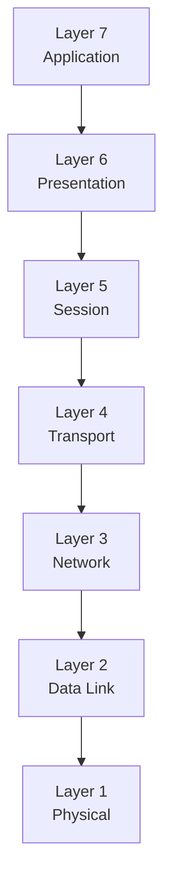
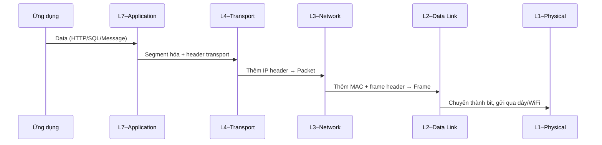

# Phase 1 – Networking Fundamentals
## Module 01 – Mô hình OSI là gì?


---


### 1. Mục tiêu của module

Sau khi hoàn thành module này, người học:

- **Nắm được** mô hình OSI gồm 7 tầng, tên gọi và vai trò chính của từng tầng.
- **Hiểu được** khái niệm *encapsulation / decapsulation*: dữ liệu được “bọc” và “gỡ bọc” qua từng tầng như thế nào.
- **Liên kết được** mỗi tầng OSI với công việc hằng ngày trong hệ thống dữ liệu (HTTP, TLS, TCP, IP, Ethernet…).
- **Nhận diện được** vị trí của các lỗi phổ biến (DNS, TCP, TLS, HTTP…) trên trục OSI.
- **Hình thành** thói quen dùng OSI như một “bản đồ” để suy nghĩ về đường đi của data / packet khi debug.

---

### 2. OSI là gì, dùng để làm gì?

Mô hình OSI (*Open Systems Interconnection*) là một **mô hình tham chiếu** gồm 7 tầng, dùng để:

- Chuẩn hóa cách nói chuyện về mạng: ai cũng có một “ngôn ngữ chung” khi mô tả network.  
- Chia nhỏ một hệ thống mạng phức tạp thành các tầng chức năng rõ ràng: từ tín hiệu vật lý cho tới dữ liệu ứng dụng.  
- Hỗ trợ **tư duy, thiết kế, debug, bảo mật** bằng cách định vị vấn đề ở tầng nào.

> [!IMPORTANT]
> OSI không phải là “mạng đang chạy theo 7 tầng y hệt như sách vở”, mà là **khung tư duy** để hiểu và phân tích các giao thức, dữ liệu và sự cố mạng.

---

### 3. 7 tầng của mô hình OSI – bản đồ tổng quát

Từ trên xuống dưới:

| Tầng | Tên tầng (tiếng Anh) | Câu nhớ nhanh |
| :---: | :-------------------- | :------------ |
| 7 | Application | Nơi ứng dụng sử dụng network (HTTP, gRPC, SQL protocol…) |
| 6 | Presentation | Chuyển đổi dữ liệu (mã hóa, nén, định dạng…) |
| 5 | Session | Quản lý phiên kết nối giữa hai đầu |
| 4 | Transport | Chia nhỏ dữ liệu, đảm bảo chuyển giao đầu-cuối (TCP, UDP) |
| 3 | Network | Định tuyến gói tin giữa các mạng (IP) |
| 2 | Data Link | Kết nối điểm-điểm trong cùng mạng (frame, MAC, switch) |
| 1 | Physical | Tín hiệu vật lý (điện, ánh sáng, sóng radio) |

Sơ đồ:



> [!NOTE]
> Mô hình TCP/IP thực tế ít tầng hơn và gộp một số tầng OSI lại với nhau, nhưng OSI thuận tiện để suy nghĩ vì nó chi tiết và rõ ràng.

---

### 4. Encapsulation – dữ liệu được “bọc” qua từng tầng

Khi một ứng dụng (ví dụ BI tool, Airflow, Spark) gửi dữ liệu, quá trình sẽ diễn ra như sau:

1. **Application** (L7) tạo ra dữ liệu ứng dụng (HTTP request, message Kafka, truy vấn SQL…).  
2. **Presentation** (L6) mã hóa / chuyển đổi / nén (nếu có).  
3. **Session** (L5) quản lý phiên kết nối (tạo, duy trì, đóng).  
4. **Transport** (L4) chia nhỏ dữ liệu thành **segment** và gắn thêm thông tin port, sequence, kiểm soát lỗi.  
5. **Network** (L3) gắn thêm địa chỉ IP nguồn/đích để định tuyến → thành **packet**.  
6. **Data Link** (L2) gắn địa chỉ MAC, thông tin frame → thành **frame**.  
7. **Physical** (L1) chuyển frame thành các **bit** và gửi trên đường truyền vật lý.

Minh họa:



Ở chiều ngược lại (khi nhận dữ liệu), các tầng thực hiện **decapsulation**, gỡ header, kiểm tra, rồi gửi phần payload lên tầng trên.

> [!TIP]
> Khi “data bị mất ở đâu đó”, câu hỏi hay nhất là: “Nó đang nằm ở tầng nào? Bị chặn / rơi / méo ở tầng nào trên đường encapsulation / decapsulation?”

---

### 5. Vai trò từng tầng – liên hệ với hệ thống dữ liệu

#### 5.1. Layer 7 – Application

- Chứa các giao thức ứng dụng:
  - HTTP/HTTPS (REST API, web UI của Snowflake, Databricks…).  
  - Giao thức riêng của database (PostgreSQL, MySQL).  
  - Giao thức ứng dụng của Kafka (Kafka protocol), gRPC, v.v.  
- Liên hệ:
  - Khi thấy lỗi `HTTP 4xx / 5xx`, `SQL error`, `Kafka protocol error`, đa số là vấn đề ở layer 7 (logic ứng dụng, API, schema, auth…).  


#### 5.2. Layer 6 – Presentation

- Xử lý:
  - Mã hóa / giải mã dữ liệu.  
  - Nén / giải nén.  
  - Chuyển đổi định dạng (ví dụ JSON, Avro, Parquet ở góc độ biểu diễn).  
- Liên hệ:
  - Trong analytics, thường gặp khi:
    - Gửi/nhận dữ liệu JSON, Avro, Protobuf.  
    - Sử dụng TLS (một số tài liệu xếp encryption ở L6, một số gắn với L5/L7; OSI là mô hình tư duy nên không cần tranh luận quá chi li).


#### 5.3. Layer 5 – Session

- Quản lý:
  - Mở, duy trì, đóng **phiên** giữa hai ứng dụng.  
  - Đồng bộ hóa, recovery phiên nếu có gián đoạn.  
- Liên hệ:
  - Các kết nối dài (long-lived connections) trong streaming, WebSocket, gRPC, hoặc session ở ứng dụng web/data platform.  
  - Trong thực tế, nhiều chức năng session nằm chung với ứng dụng hoặc transport (TCP) chứ không tách riêng hẳn như OSI.


#### 5.4. Layer 4 – Transport (TCP / UDP)

- Tầng cực kỳ quan trọng cho Data Engineer:
  - TCP: đảm bảo chuyển giao tin cậy (reliable), có thứ tự, kiểm soát lỗi, kiểm soát lưu lượng (flow control) và tắc nghẽn (congestion control).  
  - UDP: không đảm bảo, tốc độ, ít overhead (thường dùng DNS, một số streaming/telemetry).  
- Liên hệ:
  - Hầu hết kết nối DB, warehouse, Kafka, Spark… đều dựa trên TCP.  
  - Lỗi như `connection reset`, `connection timeout`, `packet loss`, `retransmission`, `high RTT` xuất phát từ vấn đề ở tầng này.


#### 5.5. Layer 3 – Network (IP)

- Xử lý:
  - Định tuyến gói tin giữa các mạng (routing).  
  - Đóng gói / gỡ gói IP: gắn địa chỉ IP nguồn/đích.  
- Thiết bị chính: router, layer-3 switch.  
- Liên hệ:
  - Lỗi “không đi tới được mạng kia”, “ping không tới”, “VPC peering chưa cấu hình”, “route table thiếu rule” là vấn đề ở Layer 3.  
  - Việc chọn region, VPC, peering giữa các môi trường cloud đều liên quan đến tầng này.


#### 5.6. Layer 2 – Data Link

- Chịu trách nhiệm:
  - Kết nối điểm-điểm trong cùng một mạng vật lý / broadcast domain.  
  - Địa chỉ MAC, khung dữ liệu (frame), kiểm soát lỗi đơn giản.  
- Thiết bị chính: switch, bridge.  
- Liên hệ:
  - Các vấn đề “loop”, “VLAN”, “MAC table”, “port bị block” – thường là việc của Infra/Network team, nhưng impact trực tiếp lên latency, packet loss, gián đoạn mạng mà Data Engineer cảm nhận được ở tầng trên.


#### 5.7. Layer 1 – Physical

- Tầng thấp nhất:
  - Dây đồng, cáp quang, WiFi, 4G/5G, đầu nối, chuẩn điện áp…  
  - Chuyển đổi bit thành tín hiệu vật lý và ngược lại.  
- Liên hệ:
  - Lỗi đứt cáp biển, hỏng port, hỏng dây → biểu hiện trên cao là latency tăng, packet loss, kết nối chập chờn.  
  - Dù Data Engineer ít khi đụng trực tiếp, nhưng nên nhận thức rằng “sự cố hạ tầng vật lý” là nguyên nhân gốc trong nhiều incident lớn.

---

### 6. Tóm tắt OSI từ Application layer đến Physical layer


Một cách nhớ theo chiều “trên xuống”:

```mermaid
flowchart TB
    A[Ứng dụng<br/>(BI, Airflow, Spark...)]
    B[Application<br/>(HTTP, SQL, Kafka protocol...)]
    C[Presentation<br/>(format, mã hóa, nén)]
    D[Session<br/>(quản lý phiên)]
    E[Transport<br/>(TCP/UDP)]
    F[Network<br/>(IP, routing)]
    G[Data Link<br/>(MAC, frame, switch)]
    H[Physical<br/>(bit, dây, sóng)]

    A --> B --> C --> D --> E --> F --> G --> H
```

- **Ứng dụng** tạo dữ liệu.  
- **Application/Presentation/Session** chuẩn bị dữ liệu để gửi.  
- **Transport** chia nhỏ, đảm bảo chuyển giao.  
- **Network** định tuyến.  
- **Data Link/Physical** chuyển thành frame và tín hiệu thực sự trên dây / sóng.

---

### 7. OSI và công việc debug trong hệ thống dữ liệu

Khi gặp một lỗi, có thể thử gán nó vào tầng OSI:

- Không ping được, *destination unreachable* → nhiều khả năng ở Layer 3–2–1.  
- Ping được nhưng không mở được TCP port (443, 5432, 9092…) → vấn đề ở Layer 4 hoặc firewall (3/4).  
- Mở được TCP nhưng TLS handshake fail → liên quan L6/L7 (chứng chỉ, cấu hình TLS).  
- TLS OK nhưng HTTP trả 4xx/5xx → logic ứng dụng (Layer 7).  
- Query đến DB nhưng treo → có thể do DB (app), nhưng cũng có thể do network phía sau (TCP retry, congestion) làm chậm hẳn.

> [!WARNING]
> OSI không nói cho biết “lỗi chính xác ở đâu”, nhưng giúp thu hẹp phạm vi: tập trung đo ở tầng nào, dùng công cụ nào (ping, traceroute, tcpdump, curl, log ứng dụng…).


---

### 8. Liên kết OSI với các phase khác trong lộ trình

- **Phase 2 – DNS**: chủ yếu sống giữa Application (tầng protocol DNS) và Transport/Network (UDP/TCP + IP).  
- **Phase 3 – TCP & Connections**: zoom sâu vào Layer 4.  
- **Phase 4 – HTTP/HTTPS**: zoom vào Layer 7 + TLS (giao thoa L6/L7).  
- **Phase 6 – Cloud Networking**: tập trung vào Layer 3–2–1 trên nền tảng cloud (VPC, subnet, route, security group…).  
- **Phase 7 – Data Platform Networking**: nhìn các công cụ (Kafka, Spark, Airflow…) chạy trên một stack OSI/TCP-IP đầy đủ.

---

### 9. Tóm tắt

- Mô hình OSI chia hệ thống mạng thành 7 tầng, từ tín hiệu vật lý (Layer 1) đến giao thức ứng dụng (Layer 7).  
- OSI không phải cấu trúc “cứng” của Internet, mà là **một bản đồ tư duy** giúp hiểu và debug các vấn đề networking.  
- Đối với Analytics / Data Engineer, việc gán lỗi / hành vi vào một tầng OSI cụ thể giúp:
  - Chọn đúng công cụ debug.  
  - Làm việc hiệu quả hơn với team Network / SRE / Infra.  
  - Thiết kế, review kiến trúc data platform với góc nhìn đầy đủ hơn về đường đi của dữ liệu trên network.