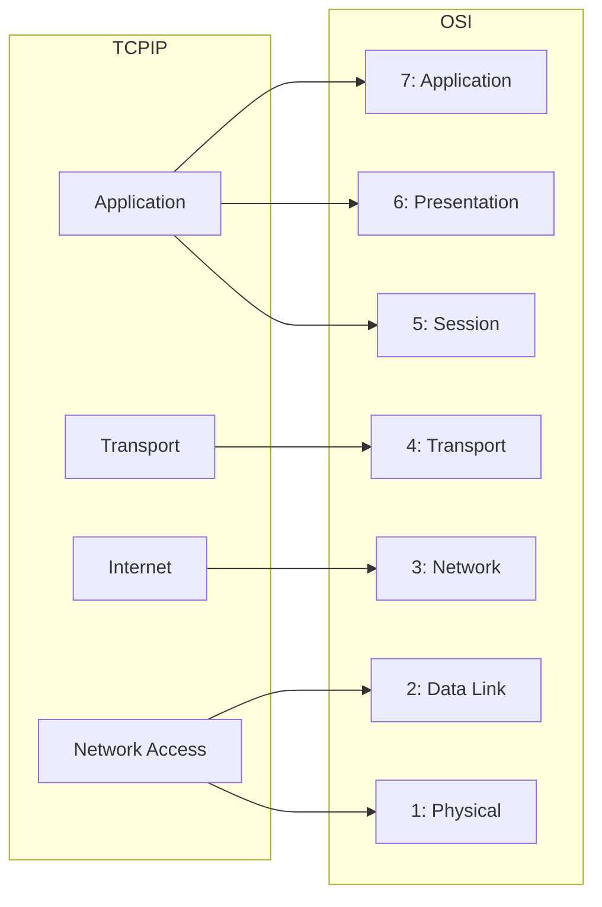

# Phase 1 – Networking Fundamentals
## Module 02 – Mô hình TCP/IP và mối quan hệ với OSI


---


### 1. Mục tiêu của module

Sau khi hoàn thành module này, người học:

- **Hiểu được** TCP/IP là gì và tại sao đây mới là “stack thực tế” Internet đang dùng.
- **Nắm được** các lớp chính trong mô hình TCP/IP và vai trò của từng lớp.
- **Map được** từng lớp TCP/IP sang các tầng tương ứng trong mô hình OSI.
- **Liên hệ được** TCP/IP với các hệ thống dữ liệu: HTTP API, JDBC, Kafka, Spark, Data Warehouse…
- **Sử dụng được** TCP/IP + OSI như một khung tư duy chung khi phân tích, thiết kế và debug hệ thống dữ liệu.


---


### 2. Tại sao phải học TCP/IP sau OSI?

- Mô hình **OSI**: công cụ tư duy 7 tầng, chi tiết, dễ dùng để phân tích.
- **TCP/IP**: bộ giao thức thực tế đang vận hành Internet và phần lớn hệ thống mạng doanh nghiệp / cloud.

> [!IMPORTANT]
> OSI giúp *hiểu*, TCP/IP giúp *gắn với thực tế*. Cần cả hai:
> - OSI: để “xếp” lỗi / hành vi vào đúng tầng.
> - TCP/IP: để nói chuyện với thế giới thực (HTTP, TCP, IP, Ethernet…) bằng tên gọi đúng.

Trong hệ thống dữ liệu:

- HTTP API, JDBC, Kafka, Spark, DNS… đều đang chạy trên **TCP/IP stack**.
- Khi nói “traffic đi qua TCP”, “IP route”, “L3 VPC”, “L4 LB”, … đều là đang nói tới các lớp trong TCP/IP.


---


### 3. Mô hình TCP/IP là gì?

TCP/IP (Transmission Control Protocol / Internet Protocol):

- Là **bộ giao thức chuẩn** dùng để kết nối các thiết bị trên Internet và trong mạng nội bộ.
- Ban đầu thiết kế cho ARPANET, sau này trở thành nền tảng của Internet hiện đại.
- Thường được mô tả với **4 hoặc 5 lớp** (khác với 7 tầng của OSI).

Phiên bản 4 lớp phổ biến:

| Lớp | Tên | Ví dụ giao thức |
| :--: | :--- | :-------------- |
| 4 | Application | HTTP, HTTPS, DNS, SMTP, FTP, giao thức DB, Kafka… |
| 3 | Transport | TCP, UDP |
| 2 | Internet | IP (IPv4/IPv6), ICMP, routing |
| 1 | Network Access / Link | Ethernet, WiFi, PPP, frame, MAC… |


```mermaid
flowchart TB
    A[Application<br/>(HTTP, DNS, DB protocol...)]
    B[Transport<br/>(TCP, UDP)]
    C[Internet<br/>(IP, ICMP, routing)]
    D[Network Access<br/>(Ethernet, WiFi, MAC, frame...)]

    A --> B --> C --> D
```


---

### 4. Các lớp trong mô hình TCP/IP

#### 4.1. Application layer (Lớp Ứng dụng)

- Chứa các giao thức ứng dụng:
  - HTTP/HTTPS, gRPC, WebSocket.
  - DNS.
  - SMTP (email), FTP, SSH.
  - Giao thức riêng của database (PostgreSQL, MySQL).
  - Giao thức Kafka, các API của Snowflake, BigQuery, Databricks…
- Đối với Data/Analytics, đây là nơi:
  - BI tool nói chuyện với warehouse.
  - Airflow gọi REST API hoặc kết nối DB.
  - Kafka client đọc/ghi message.
  - Spark submit job / đọc từ nguồn.

#### 4.2. Transport layer (TCP / UDP)

- **TCP**:
  - Kết nối hướng phiên, đáng tin cậy (reliable), có thứ tự.
  - Có cơ chế kiểm soát tắc nghẽn, kiểm soát luồng, retransmission…
  - Được dùng cho:
    - HTTP/HTTPS.
    - JDBC/ODBC, giao thức DB.
    - Kafka, Spark, gRPC…
- **UDP**:
  - Không đảm bảo, không kết nối, không retry.
  - Dùng cho:
    - DNS (đa số query dùng UDP).
    - Một số giao thức streaming, telemetry, gaming…

Trong hệ thống dữ liệu, gần như mọi kết nối “quan trọng” đều đi qua TCP.

#### 4.3. Internet layer (IP)

- Đảm nhiệm:
  - Địa chỉ IP nguồn/đích.
  - Định tuyến gói tin giữa các mạng (routing).
  - Giao thức: IPv4, IPv6, ICMP (ping), v.v.
- Liên quan trực tiếp đến:
  - VPC, subnet, route table trong cloud.
  - Peering giữa VPC, VPN kết nối on-prem ↔ cloud.
  - Latency, path đi qua các router, hop.

#### 4.4. Network Access / Link layer

- Kết nối với hạ tầng vật lý:
  - Ethernet, WiFi, VLAN, PPP…
  - Frame, MAC address, ARP…
- Thường được infrastructure/network team vận hành:
  - Switch, access point, cáp, port vật lý…
- Tác động tới:
  - Tốc độ link (1G, 10G, 40G…).
  - Packet loss, lỗi port, lỗi dây.


---


### 5. Map TCP/IP sang OSI

Bảng ánh xạ phổ biến:

| TCP/IP | OSI tương ứng | Ghi chú |
| :----- | :------------ | :------ |
| Application | Application, Presentation, Session (L7–L5) | Thực tế, ứng dụng + thư viện “gom” 3 tầng OSI vào 1 |
| Transport | Transport (L4) | TCP, UDP |
| Internet | Network (L3) | IP, routing, ICMP |
| Network Access / Link | Data Link + Physical (L2–L1) | Ethernet, WiFi, frame, MAC, tín hiệu vật lý |



> [!NOTE]
> Khi đọc tài liệu cloud / hệ thống, đa số sẽ dùng cách gọi theo TCP/IP (L3, L4, L7) hơn là “OSI Layer 3, 4, 7”, nhưng ánh xạ là tương tự.


---


### 6. Ví dụ: một HTTP request trong TCP/IP + OSI

Trường hợp: BI tool gọi HTTPS đến Snowflake / BigQuery.

**Theo OSI** (từ trên xuống):

- L7: HTTP/HTTPS request.  
- L6: Mã hóa TLS, encoding dữ liệu.  
- L5: Phiên ứng dụng (session HTTP, cookie, token…).  
- L4: TCP segment, port 443.  
- L3: IP packet (IP nguồn/đích).  
- L2: Frame Ethernet/WiFi, MAC nguồn/đích.  
- L1: Bit trên dây / sóng.

**Theo TCP/IP**:

- Application: HTTP/HTTPS, TLS, logic API / query.  
- Transport: TCP (three-way handshake, retransmission).  
- Internet: IP (định tuyến qua các router).  
- Network Access: Ethernet/WiFi (frame, MAC, physical).

> [!IMPORTANT]
> Cùng một request, nhưng có hai cách nhìn:
> - OSI: 7 tầng – hữu ích cho việc “zoom” chi tiết.
> - TCP/IP: 4 tầng – mô tả gần với cách Internet và hệ điều hành thực sự xử lý.


---


### 7. TCP/IP trong kiến trúc dữ liệu

#### 7.1. Data Warehouse / Lakehouse

```mermaid
flowchart LR
    BI[BI Tool] -->|HTTP/HTTPS<br/>(Application)| L4[TCP<br/>(Transport)]
    L4 --> L3[IP Routing<br/>(Internet)]
    L3 --> L1[Ethernet/WiFi<br/>(Network Access)]
    L1 --> DW[Endpoint DW]
```

- Application: HTTP/HTTPS API, giao thức riêng của DW.  
- Transport: TCP tới port 443 hoặc port riêng.  
- Internet: IP, routing qua Internet/VPN/VPC peering.  
- Network Access: Ethernet/WiFi ở client + cloud network ở phía DW.

#### 7.2. Kafka

- Application: Kafka protocol (sử dụng hostname, topic, partition…).  
- Transport: TCP giữa client ↔ broker.  
- Internet: nếu cross-VPC / cross-region, đi qua IP routing, NAT, peering.  
- Network Access: link trong data center / cloud (thiết lập băng thông nội bộ).

Lag tăng có thể xuất hiện ở:

- Application: consumer chậm, logic xử lý “chậm nuốt”.  
- Transport/Internet: network chậm, packet loss, TCP phải retransmit nhiều.

#### 7.3. Spark shuffle

- Application: Spark engine quyết định cần shuffle, tạo shuffle tasks.  
- Transport + Internet + Network Access: thực hiện transfer thực tế của dữ liệu giữa các executor.  
- Tóm lại: Spark logic ở Application; phần nặng nề thực sự đi trên TCP/IP ở lớp dưới.


---


### 8. TCP/IP và debug thực tế

Khi đối mặt với một lỗi, nhìn nó qua lăng kính TCP/IP:

- Application:
  - HTTP 4xx/5xx, SQL lỗi, Kafka protocol error.  
  - Auth, permission, schema, logic.

- Transport:
  - Connection refused, reset, timeout.  
  - RTT cao, retransmission, congestion.

- Internet:
  - Không ping được IP, route sai, VPC peering thiếu.  
  - NAT, VPN, firewall chặn.

- Network Access:
  - Link down, duplex mismatch, VLAN sai, sự cố cáp / port.

Ví dụ: Airflow không kết nối được Postgres:

- Có resolve được hostname không? → Application + DNS.  
- `nc -vz host 5432` có mở được TCP không? → Transport / Internet / Access.  
- Nếu TCP OK nhưng auth lỗi → Application (DB).

---

### 9. Tóm tắt

- **TCP/IP** là bộ giao thức mạng thực tế của Internet, được mô tả thường với 4 lớp: Application, Transport, Internet, Network Access.
- **OSI** là mô hình lý thuyết 7 tầng; TCP/IP gộp một số tầng OSI lại, nhưng hai mô hình có thể ánh xạ với nhau.
- Trong hệ thống dữ liệu, mọi thứ từ HTTP API, JDBC, Kafka, Spark cho tới DW đều chạy trên TCP/IP stack.
- Kết hợp OSI + TCP/IP:
  - OSI cho chi tiết, TCP/IP cho gần thực tế.
  - Giúp mô tả chính xác “dữ liệu / packet đang ở lớp nào” khi thiết kế và debug data platform.