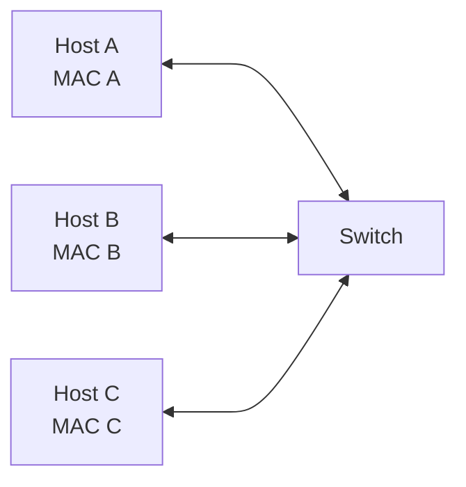
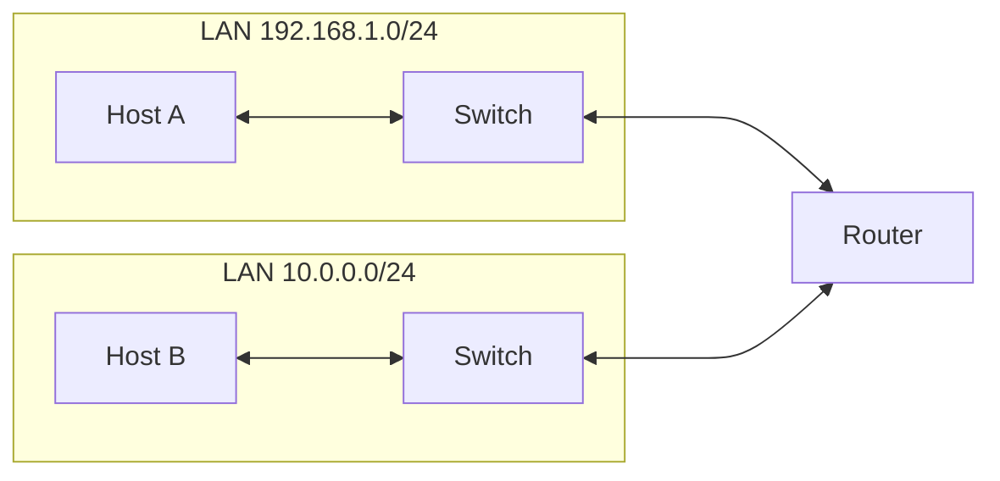
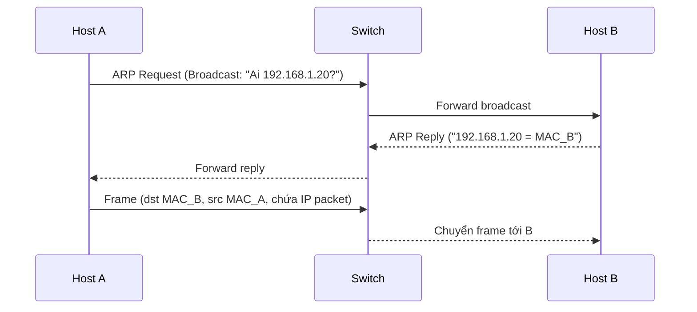

# Phase 1 – Networking Fundamentals
## Module 03 – IP, MAC, Switch, Router

---

### 1. Mục tiêu của module

Sau khi hoàn thành module này, người học:

- **Phân biệt được** địa chỉ IP và địa chỉ MAC, vai trò của từng loại địa chỉ.
- **Hiểu được** cách IP và MAC phối hợp với nhau trong một mạng (LAN) thông qua ARP.
- **Mô tả được** chức năng cơ bản của switch (L2) và router (L3) trong việc chuyển tiếp dữ liệu.
- **Nhận diện được** vị trí của IP/MAC, switch, router trong kiến trúc mạng on-prem và cloud (VPC, subnet, default gateway).
- **Liên hệ được** các khái niệm này với hệ thống dữ liệu: kết nối tới DB, warehouse, Kafka, Spark, Airflow.

---

### 2. Vì sao IP, MAC, switch, router quan trọng với Data / Analytics?

Trong hệ thống dữ liệu:

- Mỗi VM, container, pod, database, warehouse endpoint, Kafka broker… đều có **địa chỉ IP**.
- Mỗi card mạng vật lý/ảo đều có **địa chỉ MAC**.
- Các node trong cluster Spark, Kafka, Airflow thường nối với nhau qua **switch** trong cùng subnet.
- Truy cập giữa các subnet, VPC, region, on-prem ↔ cloud đi qua **router / layer‑3 switch / virtual router**.

> [!IMPORTANT]
> Mọi kết nối đến data warehouse, database, Kafka, API… cuối cùng đều là “gói IP” chạy qua switch và router. Nắm được IP, MAC, switch, router giúp đọc hiểu sơ đồ mạng và debug các lỗi “không kết nối được” một cách có hệ thống.

---

### 3. Địa chỉ IP – “địa chỉ nhà” logic trên mạng

#### 3.1. Khái niệm

- **Địa chỉ IP** là địa chỉ logic dùng để:
  - Nhận diện thiết bị trên mạng ở tầng mạng (Layer 3).
  - Định tuyến gói tin từ mạng này sang mạng khác.
- Có hai phiên bản chính:
  - IPv4: dạng `a.b.c.d`, ví dụ: `192.168.1.10`.
  - IPv6: dạng hex dài hơn, ít dùng trực tiếp trong ví dụ cơ bản.

> [!NOTE]
> IP giống như “địa chỉ nhà” để bưu điện (router) biết nên chuyển thư đi đâu. Địa chỉ này **có thể thay đổi** khi thiết bị chuyển sang mạng khác hoặc được gán lại.

#### 3.2. IP, subnet và default gateway

- **Subnet**: chia mạng thành các đoạn nhỏ hơn, ví dụ `192.168.1.0/24`.
- **Default gateway**: địa chỉ IP của router mà thiết bị sẽ gửi gói tin ra ngoài subnet của mình.

Trong một mạng gia đình:

- Router: 192.168.1.1  
- Laptop: 192.168.1.10  
- Điện thoại: 192.168.1.11  

Tất cả cùng subnet `192.168.1.0/24`, gửi ra Internet thông qua default gateway 192.168.1.1.

Trong cloud:

- VPC có dải IP riêng, ví dụ `10.0.0.0/16`.  
- Mỗi subnet (public/private) là một phần của dải đó, có router ảo (route table) đóng vai trò gateway.

---

### 4. Địa chỉ MAC – “địa chỉ card mạng” trong LAN

#### 4.1. Khái niệm

- **MAC address** (Media Access Control) là địa chỉ gắn với **card mạng** (NIC) ở tầng liên kết dữ liệu (Layer 2).
- Thường là chuỗi 6 cặp hex: `AA:BB:CC:DD:EE:FF`.
- Mỗi NIC có một MAC riêng; một máy có thể có nhiều MAC nếu có nhiều NIC (WiFi, Ethernet…).

> [!NOTE]
> MAC giống như “số seri” của card mạng. Trong một LAN, switch dựa vào MAC để gửi frame tới đúng cổng.

#### 4.2. IP vs MAC – tại sao cần cả hai?

- IP:
  - Dùng để định tuyến giữa các mạng (LAN này đến LAN khác).
  - Có thể thay đổi khi thiết bị di chuyển mạng.
- MAC:
  - Dùng để chuyển frame trong **cùng một LAN**.
  - Gắn với card mạng, thường cố định.

Hình dung:

- IP: “địa chỉ nhà” trên bản đồ thành phố (dùng cho bưu điện).  
- MAC: “tên người” / “số thẻ” dùng trong tòa nhà, để bảo vệ / lễ tân biết giao đúng người.

---

### 5. Switch – “ngã tư” trong mạng cục bộ

#### 5.1. Switch làm gì?

- Switch hoạt động chủ yếu ở **Layer 2 (Data Link)**.
- Nhiệm vụ:
  - Học và lưu **bảng MAC** (MAC address ↔ port).
  - Khi nhận một frame, đọc MAC đích:
    - Nếu biết port tương ứng → chuyển frame đúng port.  
    - Nếu chưa biết → broadcast để học.  

> [!TIP]
> Switch không “hiểu” IP (trừ khi là switch Layer 3). Đối với switch L2 thuần túy, mọi quyết định chuyển tiếp dựa trên MAC.

#### 5.2. VLAN

- Switch có thể chia một thiết bị vật lý thành nhiều mạng logic (VLAN).  
- Các VLAN khác nhau không tự nói chuyện được với nhau – cần Layer 3 (router hoặc L3 switch).

---

### 6. Router – nối các mạng lại với nhau

#### 6.1. Router làm gì?

- Router hoạt động ở **Layer 3 (Network)**.
- Nhiệm vụ:
  - Nhận gói IP, đọc IP đích.
  - Tra bảng định tuyến (routing table) để quyết định gửi gói đi tiếp qua interface nào.
  - Mỗi interface nối với một mạng/subnet khác nhau.

- Host trong `192.168.1.0/24` muốn nói chuyện với host `10.0.0.x` → gửi gói tin tới **router** (default gateway).  
- Router chuyển tiếp gói sang mạng kia dựa trên IP.

#### 6.2. Router trong cloud

Trong VPC:

- Route table của subnet đóng vai trò router “ảo”.
- Internet Gateway, NAT Gateway, VPN, peering… đều là các thành phần routing ở Layer 3.

---

### 7. IP và MAC phối hợp như thế nào? (ARP & chuyển tiếp trong LAN)

Khi một host A trong LAN muốn gửi gói IP tới host B cùng subnet:

1. A biết IP của B (ví dụ 192.168.1.20) nhưng chưa biết **MAC** của B.  
2. A gửi **ARP request** broadcast: “Ai 192.168.1.20? Hãy trả lời MAC”.  
3. B trả lời **ARP reply** unicast: “192.168.1.20 là MAC `XX:YY:ZZ:...`”.  
4. A lưu mapping IP–MAC này trong ARP cache.  
5. A đóng gói gói IP (IP nguồn/đích) vào frame Ethernet (MAC nguồn/đích) và gửi tới switch.  
6. Switch dùng bảng MAC để chuyển frame đến đúng cổng của B.

> [!IMPORTANT]
> Trong LAN, **IP quyết định “gửi cho ai ở tầng logic”**, còn **MAC quyết định “đi qua cổng nào, đến card nào”**. Router thay đổi MAC hop‑by‑hop, nhưng IP nguồn/đích đa số giữ nguyên trên toàn đường đi.

---

### 8. Liên hệ với hệ thống dữ liệu

#### 8.1. Kết nối tới database / warehouse

- JDBC/ODBC client → IP/hostname của DB/DW → DNS → IP:
  - IP quyết định route từ client tới server (qua router / VPC).  
  - Trên từng đoạn LAN, switch dùng MAC để đưa frame tới đúng server.
- Lỗi thường gặp:
  - IP sai subnet → không route được.  
  - Route table / security group / firewall chặn.  
  - ARP / switch issue → packet loss trong LAN (ít khi Data Engineer phải trực tiếp xử lý, nhưng nên biết điều này tồn tại).

#### 8.2. Kafka cluster trong VPC

- Mỗi broker có IP riêng trong subnet; client thường kết nối qua hostname được DNS resolve.  
- Các broker, zookeeper/controller, client trong cùng subnet giao tiếp qua switch; cross‑subnet/region đi qua router / peering.  
- Khi lag bất thường:
  - Cần xem xét băng thông và chất lượng link giữa subnet / VPC, không chỉ consumer code.

#### 8.3. Spark cluster

- Driver và executors:
  - Có IP riêng, thường cùng subnet.  
  - Trao đổi shuffle data qua switch / router nội bộ data center / VPC.
- Các vấn đề như:
  - Một node có NIC lỗi, port switch lỗi, link tốc độ thấp… → trở thành “nút cổ chai” của toàn job.

---

### 9. Tóm tắt

- **IP address**: địa chỉ logic ở Layer 3, dùng để định tuyến giữa các mạng.  
- **MAC address**: địa chỉ của card mạng ở Layer 2, dùng để chuyển frame trong cùng LAN.  
- **Switch**: thiết bị Layer 2, forward frame dựa trên MAC trong một mạng cục bộ.  
- **Router**: thiết bị Layer 3, forward packet dựa trên IP giữa các mạng/subnet khác nhau.  
- IP và MAC phối hợp với nhau thông qua ARP: IP quyết định đích logic; MAC đảm bảo frame đến đúng thiết bị trong từng hop.  
- Trong hệ thống dữ liệu, mọi kết nối tới DB, DW, Kafka, Spark, Airflow đều đi qua tầng IP/MAC, switch, router – hiểu được các khái niệm này giúp đọc sơ đồ mạng và debug sự cố một cách có phương pháp.