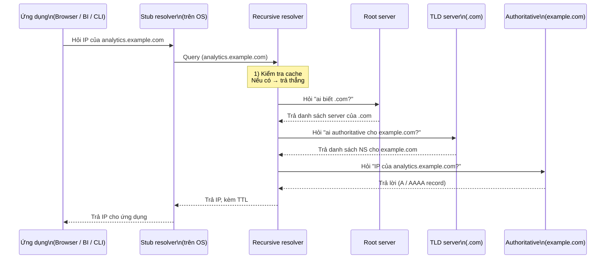

# Phase 2 – Internet & DNS
## Module 01 – DNS là gì?


---


### 1. Mục tiêu của module

Sau khi hoàn thành module này, người học:

- **Hiểu được** DNS (Domain Name System) là gì và tại sao mọi kết nối đến dịch vụ dữ liệu đều phụ thuộc vào DNS.
- **Mô tả được** kiến trúc cơ bản của DNS: stub resolver, recursive resolver, root, TLD, authoritative.
- **Vẽ được** luồng phân giải DNS từ máy client đến authoritative server.
- **Nhận diện được** vai trò của TTL và cache trong hiệu năng và hành vi của hệ thống.
- **Liên hệ được** DNS với các thành phần trong hệ thống dữ liệu: database hostname, data warehouse endpoint, Kafka broker, hostname nội bộ trên cloud.


---


### 2. DNS là gì trong hệ thống mạng?

**Domain Name System (DNS)** là hệ thống “dịch tên thành địa chỉ”:

- Chuyển **tên miền / hostname** (ví dụ `bigquery.googleapis.com`, `db.internal`, `broker-1.kafka.svc.cluster.local`)  
  → thành **địa chỉ IP** (ví dụ `142.250.x.y`).  
- Cho phép con người dùng tên dễ nhớ, trong khi máy dùng IP để định tuyến.

> [!IMPORTANT]
> Hầu như mọi kết nối trong hệ thống dữ liệu – từ BI tool, Airflow, Spark đến warehouse, DB, Kafka – đều **bắt đầu bằng một truy vấn DNS**. Nếu DNS có vấn đề, cả hệ thống có thể tê liệt dù service vẫn đang chạy bình thường.

Trong kiến trúc hiện đại, DNS không chỉ là “sổ điện thoại” mà còn là:

- Lớp **routing sớm (early routing)**: nhiều hệ thống dùng DNS để load balancing, failover, geo‑routing.  
- Lớp **cache**: giúp giảm độ trễ và giảm tải cho dịch vụ backend.  
- Lớp **control plane**: thay đổi DNS có thể “chuyển hướng traffic” mà không cần chạm vào ứng dụng.


---


### 3. Tên miền, hostname và zone

#### 3.1. Tên miền (domain name)

Ví dụ: `analytics.example.com` có dạng:

- `.` – root (mặc định, thường không viết).  
- `com` – top‑level domain (TLD).  
- `example.com` – domain.  
- `analytics.example.com` – hostname / subdomain cụ thể.

Tên miền được tổ chức theo **cấu trúc cây**, mỗi “nhánh” có thể được **ủy quyền** (delegation) cho DNS server khác quản lý.

#### 3.2. Zone

- **Zone**: một phần cây tên miền được quản lý như một đơn vị.  
- Một DNS server có thể authoritative cho một hoặc nhiều zone (ví dụ `example.com`, `internal.example.com`).

> [!NOTE]
> Trong thực tế, “zone” là đơn vị quản lý (DNS records + quyền), còn “domain” là cách ta nhìn từ góc độ tên gọi.


---


### 4. Các thành phần chính trong hệ thống DNS

#### 4.1. Stub resolver (trên máy client)

- Thư viện / thành phần trong hệ điều hành chịu trách nhiệm:
  - Nhận request phân giải tên từ ứng dụng (browser, psql, BI tool…).  
  - Gửi truy vấn tới **recursive resolver** đã cấu hình (thường là DNS của ISP, của công ty, hoặc của VPC).  
  - Nhận kết quả, trả lại cho ứng dụng và lưu cache cục bộ (ngắn).

#### 4.2. Recursive resolver (DNS resolver)

- Là server mà client tin cậy, thường do:
  - ISP, doanh nghiệp, hoặc nhà cung cấp cloud vận hành.  
- Nhiệm vụ:
  - Nhận truy vấn từ client.  
  - Kiểm tra cache của chính nó.  
  - Nếu chưa có, đi hỏi các server khác (root → TLD → authoritative) và cache kết quả lại.

#### 4.3. Root, TLD, authoritative

- **Root servers**:
  - Nắm thông tin: “TLD `.com` nằm ở đâu?”, “`.org` nằm ở đâu?”, “`.vn` nằm ở đâu?”  
  - Không trả IP website cụ thể, mà trả lời “hãy hỏi TLD server này”.

- **TLD servers**:
  - Ví dụ `.com`, `.org`, `.net`, `.vn`…  
  - Giữ thông tin: “domain `example.com` do những authoritative server nào quản lý?”.

- **Authoritative DNS servers**:
  - “Nguồn sự thật cuối cùng” cho một hoặc nhiều zone cụ thể.  
  - Lưu và trả lời các bản ghi DNS (A, AAAA, CNAME, MX, TXT…) của domain.

> [!IMPORTANT]
> Recursive resolver **tìm kiếm và cache**, authoritative server **giữ dữ liệu chính thức và trả lời cuối cùng**.


---


### 5. Luồng phân giải DNS end‑to‑end

Giả sử máy cần IP của `analytics.example.com`:



> [!TIP]
> Trong phần lớn trường hợp thực tế, nhiều bước trên được “ăn gian” nhờ cache: recursive resolver đã biết TLD, authoritative từ các truy vấn trước, nên không phải đi full chain mỗi lần.


---


### 6. TTL và cơ chế cache – tại sao hệ thống “không update ngay”?

#### 6.1. TTL (Time To Live)

- Mỗi bản ghi DNS có một giá trị **TTL** (tính bằng giây), ví dụ `300`, `3600`, `86400`.  
- TTL cho biết:
  - Recursive resolver được phép **cache kết quả trong bao lâu**.  
  - Trong thời gian TTL, resolver có thể trả kết quả từ cache mà không hỏi lại authoritative server.

Ví dụ:

- Đặt TTL = 300 (5 phút) cho `db.example.com`.  
- Khi IP của DB thay đổi:
  - Có thể mất tới 5 phút (hoặc hơn, tùy cache ở nhiều tầng) để tất cả client thấy IP mới.

#### 6.2. Các tầng cache

Cache có thể tồn tại ở:

- Ứng dụng / thư viện (một số client có DNS cache riêng).  
- Hệ điều hành (stub resolver).  
- Recursive resolver (của công ty, ISP, cloud).  
- Thậm chí ở một số thiết bị trung gian (DNS proxy, forwarder).

> [!WARNING]
> Nhiều sự cố “đã đổi DNS mà client vẫn đi về IP cũ” là do TTL + cache. Cần biết TTL hiện tại, và chấp nhận thời gian propagation, hoặc dùng kỹ thuật cắt chuyển dần.


---


### 7. Các loại bản ghi DNS cơ bản

Trong bối cảnh Data/Analytics, tập trung chủ yếu vào:

- **A**: tên → địa chỉ IPv4.  
- **AAAA**: tên → địa chỉ IPv6.  
- **CNAME**: bí danh (alias) từ một tên sang tên khác.  
- **TXT**: chứa dữ liệu text (dùng cho xác thực, metadata…).  
- **NS**: chỉ định authoritative name server cho một zone.  
- **MX**: dùng cho mail (ít liên quan trực tiếp đến data platform nhưng vẫn là kiến thức nền).

Ví dụ:

```text
analytics.example.com.    300   A      203.0.113.10
dw.example.com.           600   CNAME  bigquery.googleapis.com.
_internal-db.example.com. 60    A      10.0.4.25
example.com.              86400 NS     ns1.dns-provider.com.
```

> [!NOTE]
> Trong cloud, nhiều endpoint của warehouse, DBaaS, Kafka, API… thực chất là **CNAME trỏ tới hệ thống của provider**. Khi debug, cần kiểm tra CNAME chain, không chỉ bản ghi A đầu tiên.


---


### 8. DNS trong hệ thống dữ liệu & database

#### 8.1. Database hostname

- Thay vì kết nối DB qua IP, ứng dụng thường dùng hostname:
  - `orders-db.internal.example.com`.  
  - `mydb.abc123.rds.amazonaws.com`.  
  - `my-postgres.private-region.cloud`.  
- Lợi ích:
  - Có thể thay đổi IP DB (scale, move AZ/region, restore…) mà không phải chỉnh lại mọi app – chỉ cần update DNS/BaaS endpoint.  
  - Dễ tích hợp với load balancing, failover, multi‑AZ.

DNS tham gia vào:

- Kết nối ứng dụng ↔ DB (JDBC/ODBC).  
- Discovery giữa các node trong cluster replication.  
- Failover: `primary.db.example.com` → trỏ sang node khác.

#### 8.2. Data warehouse / lakehouse

- Snowflake, BigQuery, Redshift, Databricks… cung cấp:
  - Endpoint dạng tên miền (public hoặc private).  
  - Nhiều khi dùng DNS để:
    - Route theo region.  
    - Route theo account / organization.  
    - Load balancing, multi‑tenant.

Nếu DNS không resolve được endpoint:

- BI tool / Spark / Airflow sẽ fail *trước cả khi* gửi được bất kỳ query nào.


#### 8.3. Kafka, Airflow, Kubernetes

- Kafka:
  - Broker được khai báo bằng hostname; client cần resolve được cả tên broker và listener.  
- Airflow:
  - Thường chạy trong VPC, dùng private DNS để gọi DB, Redis, external API.  
- Kubernetes:
  - Có **cluster DNS** (CoreDNS, kube-dns) để resolve:
    - Service name (`service.namespace.svc.cluster.local`).  
    - Pod hostname (tuỳ cấu hình).

> [!TIP]
> Nhiều lỗi “service A trong cluster không gọi được service B” đơn giản là do sai DNS name (service name, namespace, domain search…) chứ không phải network “to”.


---


### 9. DNS là lớp “ẩn” nhưng thường hỏng đầu tiên

DNS có một số đặc điểm khiến nó hay trở thành nguyên nhân gốc:

- **Phụ thuộc trong mọi call**, nhưng thường bị “quên mất” trong thiết kế.  
- **Caching**:
  - Khi ổn thì rất nhanh.  
  - Khi sai thì có thể “duy trì sai lầm” rất lâu vì cache.  
- **TTL & propagation**:
  - Thay đổi record không tức thời; trong thời gian chuyển tiếp có thể tồn tại nhiều trạng thái khác nhau.  
- **Phức tạp về routing**:
  - On-prem dùng resolver A, cloud dùng resolver B.  
  - Private DNS trong VPC, split‑horizon DNS (một tên trả IP khác nhau tùy nơi truy cập).

> [!WARNING]
> Khi một ứng dụng “không kết nối được”, nếu chỉ nhìn vào log HTTP, TCP hay lỗi ứng dụng mà **không kiểm tra DNS trước**, rất dễ đi sai hướng debug.


---


### 10. Tóm tắt

- DNS là hệ thống phân giải tên → địa chỉ, là bước hầu như luôn xảy ra trước khi thiết lập kết nối TCP/HTTP tới một dịch vụ.
- Kiến trúc DNS gồm:
  - Stub resolver (trên máy client).  
  - Recursive resolver (DNS của ISP / công ty / cloud).  
  - Root → TLD → authoritative server.  
- TTL và caching quyết định:
  - Hiệu năng (giảm round trip).  
  - Hành vi cập nhật (đổi record không thấy ngay).  
- Trong hệ thống dữ liệu, DNS xuất hiện ở mọi nơi:
  - Database hostname, data warehouse endpoint, Kafka broker, service nội bộ, Kubernetes service, private DNS trên cloud.  
- Nắm được DNS là nền tảng để:
  - Debug các lỗi **không resolve được hostname**, **resolve sai IP**, **TTL/cache gây lỗi khó hiểu**.  
  - Hiểu những gì thực sự xảy ra khi gõ một hostname vào cấu hình Airflow, Spark, BI, hoặc JDBC.