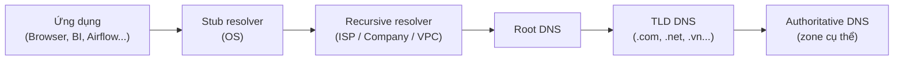
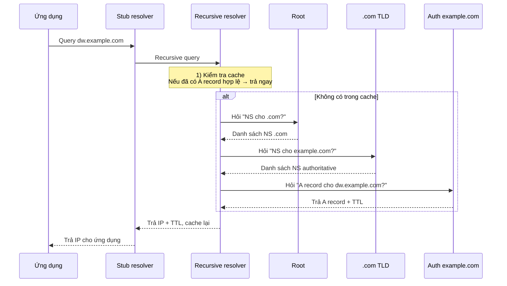

# Phase 2 – Internet & DNS
## Module 02 – Luồng phân giải DNS và cơ chế cache


---


### 1. Mục tiêu của module

Sau khi hoàn thành module này, người học:

- **Mô tả được** chi tiết luồng phân giải DNS từ ứng dụng đến authoritative server.
- **Phân biệt được** truy vấn đệ quy (recursive) và truy vấn lặp (iterative).
- **Hiểu được** cơ chế cache ở nhiều tầng (ứng dụng, hệ điều hành, recursive resolver).
- **Giải thích được** ảnh hưởng của TTL tới việc cập nhật DNS và hành vi hệ thống.
- **Sử dụng được** `dig` / `nslookup` để quan sát luồng phân giải và cache trong thực tế.


---


### 2. Ứng dụng thực tế: tại sao phải hiểu luồng phân giải?

Các tình huống điển hình:

- Đổi IP database nhưng một số service vẫn kết nối về IP cũ trong nhiều phút/giờ.  
- Một số máy trong cùng mạng resolve hostname thành IP này, máy khác lại resolve thành IP khác.  
- Endpoint của warehouse / Kafka / API trả về IP khác nhau tùy VPC, region, nơi gọi.  
- Ở môi trường on‑prem, hostname của DB nội bộ resolve được; nhưng khi chạy job trên cloud thì báo “host not found”.

> [!IMPORTANT]
> Các hiện tượng trên phần lớn không phải “DNS hỏng”, mà do **cách luồng phân giải + cache + TTL vận hành**. Module này tập trung làm rõ điều đó.


---


### 3. Vai trò của từng “lớp” trong luồng DNS

Tổng quan lại các thành phần:

- **Ứng dụng**: browser, BI tool, Airflow, Spark, Kafka client, driver JDBC…  
- **Stub resolver (trên OS)**: nhận yêu cầu từ ứng dụng, gửi DNS query ra ngoài.  
- **Recursive resolver**: DNS server mà máy trỏ tới (của ISP, công ty, cloud VPC).  
- **Hệ thống phân cấp DNS**: root → TLD → authoritative cho từng zone.

Sơ đồ tóm tắt:



Trong thực tế:

- Ứng dụng **không** nói chuyện trực tiếp với root/TLD/authoritative.  
- Mọi phức tạp đều được recursive resolver gánh: nó hỏi giúp, cache giúp, xử lý lỗi giúp.


---


### 4. Truy vấn đệ quy (recursive) và lặp (iterative)

#### 4.1. Truy vấn đệ quy (recursive query)

Khi stub resolver hỏi recursive resolver:

- “Hãy cho tôi IP của `analytics.example.com`. Tôi **chỉ nhận câu trả lời cuối cùng**, không tự đi hỏi thêm được.”  

Recursive resolver:

- Hoặc trả lại kết quả đã cache.  
- Hoặc tự đi hỏi root → TLD → authoritative và trả lại kết quả cuối cùng cho stub resolver.

Đây là loại truy vấn mà **client bình thường** thực hiện.

#### 4.2. Truy vấn lặp (iterative query)

Giữa các DNS server với nhau (recursive ↔ root/TLD/authoritative):

- Recursive hỏi root:  
  - Root không resolve toàn bộ, mà trả: “Ta không biết IP đó, nhưng đây là danh sách server cho `.com`”.  
- Recursive hỏi TLD `.com`:
  - TLD trả: “Đây là danh sách authoritative NS cho `example.com`”.  
- Recursive hỏi authoritative:
  - Authoritative mới trả A/AAAA/CNAME record mong muốn.

Mỗi bước, server **không tiếp tục truy vấn thay** mà chỉ trả “manh mối kế tiếp” – đó là tính chất “lặp (iterative)”.


---


### 5. Luồng phân giải chi tiết – có cache

Trường hợp muốn IP của `dw.example.com`:



Điểm cần chú ý:

- Recursive resolver có thể đã biết trước NS của `.com`, `example.com` từ các truy vấn trước → bỏ qua nhiều bước.  
- Càng nhiều request giống nhau trong thời gian TTL, càng tận dụng được cache.


---


### 6. Cache ở nhiều tầng – ai cache gì?

Các lớp cache điển hình:

1. **Ứng dụng / thư viện**:
   - Một số runtime (Java, .NET, một số driver JDBC) cache kết quả DNS trong bộ nhớ.  
   - Thời gian cache có thể bằng TTL hoặc cố định (một số runtime cũ cache gần như vô hạn nếu không cấu hình).

2. **Stub resolver / OS**:
   - Windows, macOS, một số distro Linux có DNS cache cục bộ.  
   - Lệnh kiểm tra / xóa:
     - Windows: `ipconfig /displaydns`, `ipconfig /flushdns`.  
     - macOS: `sudo killall -HUP mDNSResponder` (tuỳ phiên bản).  
     - Linux: tùy dịch vụ (systemd-resolved, nscd, dnsmasq…).

3. **Recursive resolver**:
   - Cache chính, thường ở scale lớn (DNS của ISP, DNS nội bộ công ty, DNS trong VPC).  
   - Tuân thủ TTL của authoritative (thông thường), đôi khi áp chính sách riêng.

> [!WARNING]
> Khi đổi DNS record mà hệ thống vẫn dùng IP cũ, phải nhớ rằng **có thể có cache ở 2–3 tầng khác nhau**, không chỉ ở DNS public.


---


### 7. TTL trong thực tế: trade‑off giữa tốc độ và tính linh hoạt

#### 7.1. TTL thấp vs TTL cao

- **TTL thấp** (Ví dụ 30–60 giây):
  - Ưu:
    - Đổi IP / route nhanh được áp dụng.  
    - Phù hợp với môi trường hay scale, failover.  
  - Nhược:
    - Nhiều truy vấn hơn lên authoritative / resolver.  
    - Tăng độ trễ tổng thể nếu resolver không cache mạnh.

- **TTL cao** (Ví dụ 3600–86400 giây):
  - Ưu:
    - Tận dụng cache tối đa, giảm lượng truy vấn, giảm latency.  
    - Ổn định nếu IP ít thay đổi.  
  - Nhược:
    - Thay đổi khó propagate nhanh; dễ gặp tình trạng “nơi cũ, nơi mới”.

#### 7.2. Chiến lược khi sắp thay đổi IP / endpoint

Thông lệ:

1. **Giảm TTL trước** (ví dụ từ 3600 xuống 60) vài giờ/ngày trước khi cắt chuyển.  
2. Đợi TTL cũ hết hiệu lực (đảm bảo cache cũ không còn).  
3. Thay đổi IP / CNAME.  
4. Sau khi hệ thống ổn định, tăng TTL trở lại để tiết kiệm.

> [!TIP]
> Khi thiết kế hệ thống dữ liệu có yêu cầu HA/DR cao, việc chọn TTL cho DNS endpoint của DB, warehouse, API là một phần quan trọng của kiến trúc.


---


### 8. DNS trong môi trường on‑prem, VPN và cloud

#### 8.1. On‑prem

- Thường có **DNS nội bộ** cho:
  - Hostname máy chủ DB, app, file server…  
- Máy client trong công ty:
  - Dùng DNS internal để resolve `db.internal.example.com`.  
  - Không nhất thiết thấy được DNS này từ Internet.

#### 8.2. Cloud (VPC, Private DNS)

Trên cloud:

- Mỗi VPC có **DNS resolver riêng** (ví dụ `169.254.169.253` trên GCP, địa chỉ riêng trên AWS).  
- Có thể cấu hình:
  - Private zone: chỉ resolve được từ trong VPC / network đã liên kết.  
  - Split‑horizon DNS: cùng một tên nhưng trả IP khác nhau tuỳ nơi hỏi (internal vs external).

Ví dụ:

- `warehouse.example.com`:
  - Từ Internet: IP public của LB.  
  - Từ trong VPC: IP private của service.

#### 8.3. VPN và hybrid

Khi kết nối on‑prem ↔ cloud qua VPN:

- Cần quyết định:
  - Client on‑prem dùng DNS nào để resolve host trong cloud?  
  - Service trên cloud dùng DNS nào để gọi về on‑prem?  
- Nhiều mô hình dùng:
  - Forwarder / conditional forwarder: DNS on‑prem forward truy vấn cho một số zone nhất định sang DNS trên cloud, hoặc ngược lại.


---


### 9. Công cụ quan sát DNS resolution

#### 9.1. `dig`

Một số ví dụ hữu ích:

```bash
# Truy vấn A record
dig dw.example.com

# Truy vấn chi tiết + server được hỏi
dig dw.example.com +nocmd +noall +answer +authority

# Xem toàn bộ chuỗi phân giải (như traceroute cho DNS)
dig dw.example.com +trace
```

- `+trace`: client tự làm vai trò recursive, hỏi trực tiếp root → TLD → authoritative, bỏ qua cache cục bộ, giúp thấy rõ đường đi.

#### 9.2. `nslookup`

Cú pháp đơn giản, có sẵn trên nhiều hệ điều hành:

```bash
nslookup dw.example.com
nslookup dw.example.com <dns-server>
```

Có thể dùng để thử hỏi từng DNS server cụ thể (DNS nội bộ, DNS của VPC, DNS public) và so sánh kết quả.


#### 9.3. Kiểm tra TTL và cache

- Kết quả `dig` / `nslookup` thường hiển thị **TTL còn lại** (giây).  
- Có thể chạy lại nhiều lần để thấy TTL giảm dần:
  - TTL giảm từ 300 → 295 → 290… cho thấy kết quả đến từ cache.  
  - TTL reset lại 300 → resolver vừa hỏi lại authoritative.


---


### 10. Tóm tắt

- Luồng DNS thực tế: Ứng dụng → Stub resolver → Recursive resolver → (có thể) Root → TLD → Authoritative → quay lại theo đường ngược, với cache xen giữa.
- Client gửi **truy vấn đệ quy**, còn DNS server giữa chặng dùng **truy vấn lặp** để chuyển tiếp trách nhiệm.
- Cache tồn tại ở nhiều tầng (ứng dụng, OS, recursive resolver), điều khiển bởi TTL của record.
- TTL là con dao hai lưỡi:
  - TTL thấp: linh hoạt khi đổi IP, nhưng tốn truy vấn hơn.  
  - TTL cao: hiệu quả và nhanh hơn khi ổn định, nhưng update chậm.
- Trong hệ thống dữ liệu, DNS là lớp nền cho:
  - Database hostname, warehouse endpoint, Kafka broker, API, service trong Kubernetes / VPC.  
- Hiểu rõ luồng phân giải và cache giúp:
  - Debug các vấn đề “hostname lúc được lúc không”, “đổi IP mà vẫn kết nối về chỗ cũ”.  
  - Thiết kế kiến trúc tên và TTL phù hợp với yêu cầu HA, DR, scale của data platform.