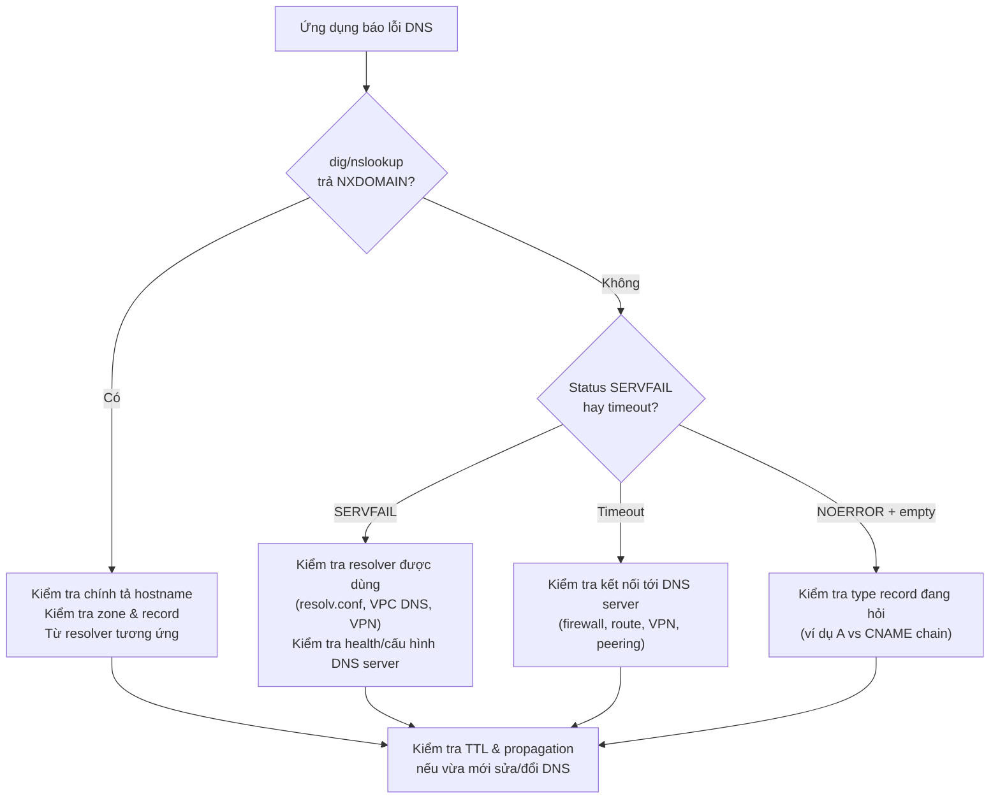

# Phase 2 – Internet & DNS
## Module 03 – Lỗi DNS: NXDOMAIN, SERVFAIL và các tình huống thực tế


---


### 1. Mục tiêu của module

Sau khi hoàn thành module này, người học:

- **Nhận diện được** các loại lỗi DNS phổ biến: NXDOMAIN, SERVFAIL, NOERROR nhưng không có bản ghi, timeout…
- **Hiểu được** ý nghĩa của từng loại lỗi từ góc nhìn ứng dụng và từ góc nhìn resolver.
- **Mô tả được** luồng dẫn đến NXDOMAIN vs SERVFAIL và cách cache các lỗi này.
- **Liên hệ được** các lỗi DNS với tình huống thực tế trong hệ thống dữ liệu (DB hostname sai, private DNS trên cloud, lỗi khi chuyển region…).
- **Áp dụng được** `dig` / `nslookup` để phân biệt loại lỗi và khoanh vùng nguyên nhân.[web:132]


---


### 2. Phân loại kết quả một truy vấn DNS

Khi một recursive resolver xử lý truy vấn, về bản chất có ba nhóm kết quả chính:

1. **Trả về dữ liệu hợp lệ**  
   - Ví dụ: A/AAAA/CNAME record tồn tại, trả về IP.

2. **Trả về phản hồi “không tồn tại” (negative answer)**  
   - Ví dụ: NXDOMAIN (tên không tồn tại), NOERROR nhưng không có type requested.

3. **Không trả về thông tin hữu ích (resolution failure)**  
   - Ví dụ: SERVFAIL, timeout, lỗi DNSSEC…

Module này tập trung vào nhóm (2) và (3), vì đây là nguồn gốc của nhiều lỗi khó chịu trong hệ thống dữ liệu.


---


### 3. NXDOMAIN – tên không tồn tại

#### 3.1. Định nghĩa

- **NXDOMAIN** = *Non‑Existent Domain*.  
- Resolver **đã hỏi authoritative server** và nhận được câu trả lời rõ ràng:  
  - “Tên miền/hostname này **không tồn tại** trong zone của tôi.”

Ví dụ:

```bash
dig does-not-exist.example.com

;; ->>HEADER<<- opcode: QUERY, status: NXDOMAIN, ...
```

Ý nghĩa:

- Không phải lỗi mạng, không phải lỗi server.  
- Chỉ đơn giản là **tên sai** hoặc chưa được cấu hình trong DNS.

#### 3.2. Cách cache NXDOMAIN

- NXDOMAIN cũng có thể (và nên) được cache, kèm TTL (negative TTL).  
- Tác dụng:
  - Giảm load lên authoritative server khi có nhiều truy vấn sai.  
- Hệ quả:
  - Nếu cấu hình DNS sai (ví dụ gõ sai, hoặc xóa record nhầm), NXDOMAIN có thể được cache một thời gian, khiến sửa lại vẫn phải đợi TTL của negative cache.


#### 3.3. Tình huống thực tế

- Gõ nhầm hostname DB: `mydb.internl` thay vì `mydb.internal`.  
- Chưa tạo DNS record cho hostname mới của Kafka broker / service.  
- DNS private zone trên cloud chưa đồng bộ hoặc cấu hình sai tên.

Từ góc nhìn ứng dụng:

- Thường thấy thông báo tương đương:  
  - “could not resolve host name”,  
  - “Name or service not known”,  
  - “Unknown host”.

> [!TIP]
> Nếu thấy NXDOMAIN, bước đầu tiên là kiểm tra **chính tả hostname** và **tồn tại record trong zone** – không phải kiểm tra firewall hay route.


---


### 4. NOERROR nhưng không có bản ghi mong muốn

Một trường hợp khác:

- Status: **NOERROR** (tức là tên tồn tại).  
- Nhưng không có bản ghi type yêu cầu (ví dụ A/AAAA không có, chỉ có CNAME/MX).

Ví dụ:

```bash
dig TXT example.com
# Trả về TXT record → OK

dig A example.com
# Status: NOERROR nhưng phần ANSWER rỗng (không có A record)
```

Ý nghĩa:

- Tên miền tồn tại, nhưng **loại bản ghi** đang hỏi không được cấu hình.  
- Có thể cần:
  - Thêm A/AAAA record.  
  - Hoặc theo CNAME chain đến tên khác.


---


### 5. SERVFAIL – lỗi khi phân giải (resolver thất bại)

#### 5.1. Định nghĩa

- **SERVFAIL** = *Server Failure*.  
- Resolver **không thể hoàn thành truy vấn**, nhưng **không khẳng định tên không tồn tại**.  
- Lý do có thể đến từ:
  - Lỗi tạm thời trên authoritative server (unreachable, trả lời lỗi).  
  - Lỗi cấu hình zone.  
  - Lỗi DNSSEC validation.  
  - Vấn đề giữa resolver và upstream (timeout, REFUSED, lỗi hạ tầng).

Ví dụ:

```bash
dig some-host.example.com

;; ->>HEADER<<- opcode: QUERY, status: SERVFAIL, ...
```

> [!IMPORTANT]
> NXDOMAIN = tên chắc chắn không tồn tại.  
> SERVFAIL = resolver **bó tay**, chưa biết chắc tên có hay không.

#### 5.2. Nguyên nhân phổ biến

Một số nguyên nhân thường gặp:

- **Authoritative không trả lời đúng cách**:
  - Không reachable (lỗi mạng, firewall).  
  - Trả RESPONSE bị lỗi / bất hợp lệ.  

- **Lỗi cấu hình DNSSEC**:
  - Bản ghi ký sai, thiếu chuỗi tin cậy, key hết hạn.  
  - Resolver DNSSEC‑enabled sẽ cho rằng kết quả không đáng tin → SERVFAIL.

- **Resolver local có vấn đề**:
  - Quá tải, hết tài nguyên.  
  - Cấu hình forwarder sai.  
  - Lỗi trong phần mềm DNS.

#### 5.3. Cache lỗi SERVFAIL

- Một số resolver có thể cache lỗi loại “resolution failure” (SERVFAIL, timeout) trong thời gian ngắn để tránh spam truy vấn tới upstream.  
- Điều này nghĩa là:
  - Nếu authoritative đang gặp sự cố, một số resolver có thể trả SERVFAIL từ cache trong một khoảng thời gian.  
  - Từ góc nhìn client, dịch vụ “bỗng dưng hỏng” nhưng sau vài phút/hàng chục phút thì tự khỏi.


---


### 6. Timeout và không nhận được phản hồi

Trường hợp xấu hơn:

- Resolver gửi truy vấn, nhưng **không nhận được phản hồi** trong thời gian quy định (timeout).  
- Tùy phần mềm và cấu hình, có thể:
  - Thử lại nhiều lần, thử nhiều NS khác nhau.  
  - Cuối cùng trả SERVFAIL hoặc một lỗi khác cho client.

Đối với ứng dụng:

- Thường thấy: “DNS timeout”, “Temporary failure in name resolution” hoặc chuyển thành timeout ở tầng cao hơn (TCP, HTTP).


---


### 7. So sánh nhanh NXDOMAIN vs SERVFAIL

| Đặc điểm | NXDOMAIN | SERVFAIL |
| :------- | :------- | :------- |
| Ý nghĩa | Tên không tồn tại (authoritative khẳng định) | Resolver không hoàn thành truy vấn, chưa biết tên có tồn tại không |
| Nguyên nhân chính | Sai tên, chưa tạo record, domain chưa đăng ký | Lỗi ở resolver hoặc authoritative (mạng, cấu hình, DNSSEC, hạ tầng) |
| Có thể cache? | Có, với negative TTL | Có (tùy resolver, thường là thời gian ngắn) |
| Hướng xử lý | Kiểm tra chính tả hostname, zone và record | Kiểm tra tình trạng DNS server, đường mạng, DNSSEC, cấu hình forwarder |


> [!TIP]
> Khi thấy NXDOMAIN, tập trung vào **tên & record**.  
> Khi thấy SERVFAIL, tập trung vào **DNS server & hạ tầng** (thường ngoài phạm vi ứng dụng).


---


### 8. DNS errors trong hệ thống dữ liệu – các pattern điển hình


#### 8.1. Airflow không resolve được hostname database

- Log: “could not translate host name”, “Name or service not known”.  
- `dig` / `nslookup` từ máy dev thì OK, từ container Airflow thì NXDOMAIN / SERVFAIL.  

Nguyên nhân thường gặp:

- Airflow chạy trong VPC / namespace khác, dùng **DNS resolver khác** so với laptop.  
- Private zone không được gắn đúng VPC / cluster.  
- `search domain` khác nhau, làm hostname ngắn (`db`) được expand thành domain khác (`db.other.local`) và fail.

Giải pháp:

- Chạy `dig` / `nslookup` **bên trong container/pod** Airflow.  
- So sánh kết quả với máy dev; kiểm tra `/etc/resolv.conf`, DNS của VPC/cluster.


#### 8.2. Đổi hostname / domain database nhưng ứng dụng cũ vẫn dùng

- Chuyển từ `db-old.company.com` → `db.company.com`.  
- Một số ứng dụng vẫn resolve `db-old` trong nhiều giờ, dù đã đổi config.

Nguyên nhân:

- **Cache DNS** tại:
  - Resolver nội bộ.  
  - OS hoặc runtime ứng dụng (ví dụ Java, .NET).  
- Negative hoặc positive TTL dài, chưa hết hạn.

Giải pháp:

- Kiểm tra TTL của record cũ.  
- Flush DNS trên client nếu có thể.  
- Nếu dùng Java, kiểm tra cấu hình `networkaddress.cache.ttl` và `networkaddress.cache.negative.ttl`.


#### 8.3. Endpoint warehouse multi‑region, kết quả DNS khác nhau

- `warehouse.example.com` resolve:
  - Từ VN → IP gần region Asia.  
  - Từ EU → IP gần region Europe.  

Không phải lỗi, mà là **Geo‑DNS / Anycast / split‑horizon**:

- DNS trả IP khác nhau tùy vị trí resolver.  
- Với Data Engineer: cần biết endpoint “không cố định một IP”, không nên hard‑code IP.


#### 8.4. Kafka / Spark trong Kubernetes: service không resolve được

- Service A muốn gọi service B bằng tên `service-b`.  
- Pod A log: “Name or service not known”, `dig service-b` trả NXDOMAIN.

Nguyên nhân:

- Sai namespace (`service-b` vs `service-b.namespace.svc.cluster.local`).  
- Sai `clusterDomain` hoặc thiếu search domain trong `/etc/resolv.conf`.  
- DNS Pod (CoreDNS) gặp lỗi, trả SERVFAIL.

Giải pháp:

- Kiểm tra `kubectl exec` vào pod, chạy `cat /etc/resolv.conf`, `dig service-b`, `dig service-b.namespace`…  
- Kiểm tra health/log của CoreDNS / kube-dns.


---


### 9. Lưu đồ suy nghĩ khi gặp lỗi “không resolve được hostname”



> [!TIP]
> Luôn bắt đầu bằng `dig` / `nslookup` từ **cùng môi trường** với ứng dụng (container, VM, pod), không chỉ từ laptop.


---


### 10. Tóm tắt

- DNS có nhiều kiểu kết quả, trong đó quan trọng nhất về mặt lỗi là:
  - **NXDOMAIN**: tên không tồn tại – vấn đề ở tên hoặc bản ghi.  
  - **SERVFAIL**: resolver không giải được – vấn đề ở DNS server / hạ tầng, không phải tên.  
  - **NOERROR nhưng không có bản ghi**: tên có, nhưng loại record đang hỏi không tồn tại.
- Cache và TTL áp dụng cho cả kết quả thành công và lỗi (negative caching), có thể làm cả “cái đúng” lẫn “cái sai” kéo dài thêm một thời gian.
- Trong hệ thống dữ liệu, nhiều sự cố:
  - Không connect được DB/warehouse/broker.  
  - Connect chỗ này được, chỗ kia không.  
  - Đổi endpoint nhưng app cũ vẫn chạy về IP cũ.  
  đều có gốc từ DNS (tên, zone, resolver, cache, TTL) hơn là từ bản thân database/warehouse/Kafka.