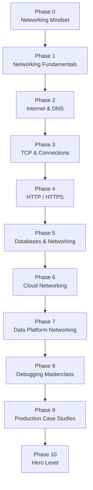

# Networking for Data Analytics Engineers

> Bộ **ghi chép cá nhân** về Networking dành riêng cho bối cảnh **Data / Analytics / BI / Analytics Engineering** – tập trung vào cách network ảnh hưởng tới hệ thống dữ liệu và cách debug sự cố trong môi trường production.

Các file trong repo này không phải giáo trình chính thức hay khóa học thương mại, mà là tập hợp:

- Ghi chú, sơ đồ, ví dụ và playbook debug được đúc kết khi làm việc với hệ thống dữ liệu thực tế.  
- Các mô hình, flow và packet-flow được diễn giải theo cách “Data-first”: luôn gắn với Snowflake, BigQuery, Kafka, Spark, Airflow, PostgreSQL/MySQL, và networking trên cloud.  
- Các case-study, failure scenarios và thói quen tư duy hệ thống (system thinking) khi phân tích vấn đề.

---

## 1. Mục tiêu cuối cùng

Bộ ghi chép này được xây dựng với mục tiêu:

- Hệ thống hóa lại kiến thức Networking theo đúng nhu cầu của người làm Data / Analytics, tránh lan man vào những phần ít liên quan đến hệ thống dữ liệu.  
- Tạo một “sổ tay” để khi gặp các lỗi `timeout`, `connection failed`, `Kafka lag`, `DNS/TLS issues`… có thể tra lại nhanh cách nghĩ, cách đo, cách debug.  
- Gắn kết Networking với:
  - Data Warehouse / Lakehouse (Snowflake, BigQuery, Redshift, Databricks).  
  - Hệ thống streaming (Kafka).  
  - Hệ thống compute (Spark, Kubernetes).  
  - Hệ thống orchestration (Airflow).  
  - Cloud networking (VPC, peering, NAT, firewall…)
  
Nói ngắn gọn: đây là nơi gom lại mọi thứ liên quan đến **“networking mà một người làm dữ liệu thực sự cần”**.

---

## 2. Đối tượng sử dụng

Các ghi chép này được viết ra **cho chính tôi**, nhưng có thể hữu ích nếu:

- Đang làm **Data Analyst / BI Developer / Analytics Engineer** và muốn hiểu sâu hơn phần “đường mạng phía dưới”.  
- Đang làm **Data Engineer / Platform Engineer** nhưng nền tảng Networking bị rỗng hoặc rời rạc.  
- Đã từng gặp các lỗi sản xuất khó chịu liên quan đến network (query treo, DAG fail, Kafka lag…) và muốn có một bộ khung để suy nghĩ lại cho có hệ thống.

Không yêu cầu kiến thức Networking trước đó; chỉ cần đã từng làm việc với một số hệ thống dữ liệu (VD: viết SQL, chạy DAG, tương tác với Kafka, Spark, Data Warehouse…).

---

## 3. Triết lý thiết kế ghi chép

### 3.1. Feynman Technique

Mỗi chủ đề đều được triển khai theo hướng:

1. Bắt đầu từ **trực quan và ví dụ đời thường**.  
2. Dần dần đi xuống các chi tiết kỹ thuật (OSI, TCP handshake, RTT, RTO, congestion control…).  
3. Liên hệ ngay sang **bối cảnh hệ thống dữ liệu** thay vì chỉ đứng ở góc độ “mạng máy tính thuần túy”.

---

### 3.2. First Principles

Thay vì liệt kê định nghĩa, ghi chép luôn cố gắng trả lời:

- Tại sao lại cần khái niệm / giao thức này?  
- Nếu bỏ nó đi thì hệ thống dữ liệu gặp vấn đề gì?  
- Vấn đề gốc mà nó nhắm tới là gì?

---

### 3.3. Socratic Method & Learning by Debugging

- Mỗi module đều có phần **failure scenarios**, **debug playbook**, và **tình huống production**.  
- Các câu lệnh như `ping`, `traceroute`, `mtr`, `dig`, `curl`, `nc`, `ss`, `netstat`, `tcpdump`… được đưa vào theo dạng “ghi chép thực chiến”: khi nào dùng, mong đợi thấy gì.

Mục tiêu: khi gặp lỗi, có thể mở lại đúng module tương ứng và dùng như một checklist / framework suy nghĩ.

---

## 4. Cấu trúc repository

```text
i-learn-networking/
│
├── README.md
│
├── Phase-0-Networking-Mindset/
│   ├── Module-01-What-Is-A-Network.md
│   ├── Module-02-How-Data-Flows-End-To-End.md
│   └── Module-03-Networking-For-Analytics-Engineers.md
│
├── Phase-1-Networking-Fundamentals/
│   ├── Module-01-OSI-Model-Basics.md
│   ├── Module-02-TCP-IP-Model-Basics.md
│   ├── Module-03-IP-MAC-Switch-Router.md
│   └── Module-04-From-Laptop-To-Internet.md
│
├── Phase-2-Internet-And-DNS/
│   ├── Module-01-What-Is-DNS.md
│   ├── Module-02-DNS-Resolution-And-Cache.md
│   ├── Module-03-DNS-Errors-NXDOMAIN-SERVFAIL.md
│   └── Module-04-DNS-In-Data-Platforms.md
│
├── Phase-3-TCP-And-Connections/
│   ├── Module-01-TCP-Handshake-RTT-RTO.md
│   ├── Module-02-Retransmission-Congestion-Control.md
│   ├── Module-03-Latency-Throughput-Packet-Loss.md
│   └── Module-04-TCP-In-DB-JDBC-Spark-Airflow.md
│
├── Phase-4-HTTP-HTTPS/
│   ├── Module-01-HTTP-Basics-Methods-Headers.md
│   ├── Module-02-REST-Data-APIs-For-Analytics.md
│   ├── Module-03-TLS-Certificates-And-Handshake.md
│   └── Module-04-HTTP-HTTPS-In-Snowflake-Databricks-Airflow.md
│
├── Phase-5-Databases-And-Networking/
│   ├── Module-01-PostgreSQL-MySQL-Over-TCP.md
│   ├── Module-02-Connection-Pool-JDBC-ODBC.md
│   ├── Module-03-Timeouts-Locks-Network-vs-DB-Issues.md
│   └── Module-04-Analytics-Warehouse-Connectivity.md
│
├── Phase-6-Cloud-Networking/
│   ├── Module-01-VPC-Subnet-Routing-Basics.md
│   ├── Module-02-Security-Groups-Firewalls-NACLs.md
│   ├── Module-03-NAT-Gateway-Internet-Gateway-VPN.md
│   └── Module-04-Cloud-DW-Networking-Snowflake-BigQuery-Redshift.md
│
├── Phase-7-Data-Platform-Networking/
│   ├── Module-01-Kafka-Networking-And-Security.md
│   ├── Module-02-Spark-Networking-Shuffle-And-IO.md
│   ├── Module-03-Airflow-Networking-Connections-And-VPC.md
│   └── Module-04-Kubernetes-Networking-For-Data-Workloads.md
│
├── Phase-8-Debugging-Masterclass/
│   ├── Module-01-DNS-Debugging-With-dig-nslookup.md
│   ├── Module-02-TCP-Debugging-With-tcpdump-ss-netstat.md
│   ├── Module-03-TLS-Debugging-With-openssl-curl.md
│   └── Module-04-Routing-Traceroute-mtr-Scenarios.md
│
├── Phase-9-Production-Case-Studies/
│   ├── Module-01-Query-Timeouts-And-Root-Causes.md
│   ├── Module-02-Kafka-Lag-And-Network.md
│   ├── Module-03-Spark-Shuffle-And-Cluster-Network.md
│   └── Module-04-Load-Balancer-And-Cloud-Networking-Incidents.md
│
└── Phase-10-Hero-Level/
    ├── Module-01-Networking-And-Distributed-Systems.md
    ├── Module-02-Designing-Reliable-Data-Platforms.md
    ├── Module-03-Scalability-Latency-And-Throughput-Tradeoffs.md
    └── Module-04-From-Debugger-To-Architect.md
```

---

## 5. Roadmap tổng quan (Mermaid)



---

## 6. Cấu trúc mỗi module

Mỗi file `Module-XX-*.md` được viết theo khung:

1. Mục tiêu của module  
2. Vai trò trong công việc Analytics / Data  
3. Network / khái niệm liên quan ở mức trực quan  
4. Phần kỹ thuật (deep dive)  
5. Thực tế production  
6. Các kịch bản lỗi thường gặp  
7. Sổ tay debug (lệnh, bước kiểm tra)  
8. Ví dụ gắn với hệ thống dữ liệu (DW, Kafka, Spark, Airflow…)  
9. Tóm tắt  
10. (Tùy module) Bài tập / tình huống tự suy nghĩ

Sơ đồ, flow, kiến trúc sử dụng **Mermaid** để hiển thị trực tiếp trên GitHub trong file markdown.

---

## 7. Cách đọc / sử dụng các ghi chép

- Có thể đọc tuần tự theo **Phase**, hoặc nhảy thẳng tới module đang cần (VD: DNS → Phase 2; TCP → Phase 3; TLS → Phase 4; Kafka → Phase 7).  
- Khi gặp vấn đề trong thực tế:
  - Xác định nó thuộc “nhóm chủ đề” nào (DNS, TCP, TLS, routing, cloud networking…).  
  - Mở lại module tương ứng để dùng phần “Sổ tay debug” và “Failure scenarios” như checklist.  
- Khi thiết kế hệ thống mới:
  - Tham khảo các phần **Hero Level** để suy nghĩ về latency, throughput, reliability dưới góc nhìn network + distributed systems.

---

## 8. Ghi chú

- Mọi nội dung mang tính **note cá nhân**, ưu tiên tính thực dụng cho công việc hơn là tính hàn lâm.  
- Không thay thế cho tài liệu chính thức của nhà cung cấp dịch vụ (AWS, GCP, Azure, Snowflake, Databricks…), mà đóng vai trò như một lớp “dịch thuật” sang ngôn ngữ và mindset của người làm dữ liệu.
